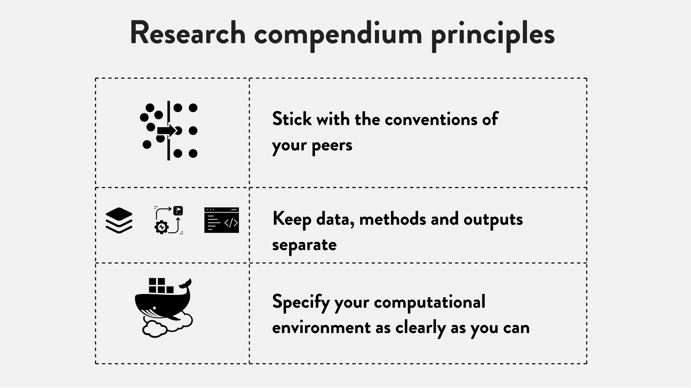
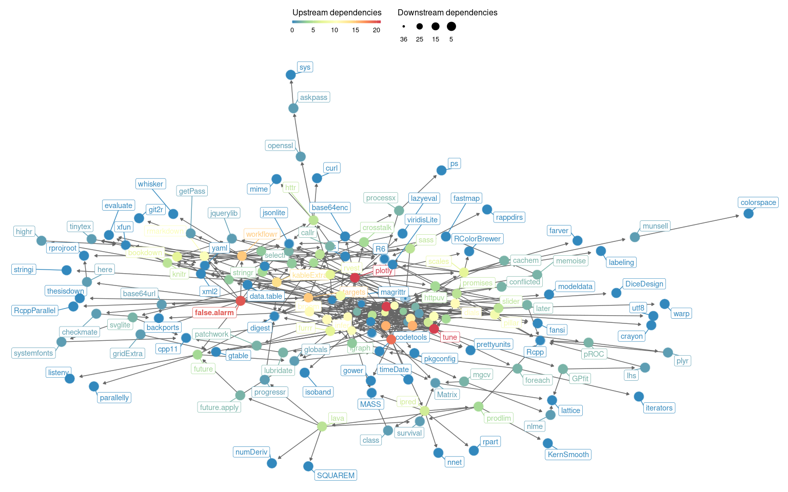

Detecting life-threatening patterns in Point-of-care ECG using efficient
memory and processor power.
================
Francisco Bischoff
on julho 15, 2021

<!-- README.md is generated from README.Rmd. Please edit that file -->
<!-- badges: start -->

<!-- badges: end -->

# Abstract

Currently, Point-of-Care (POC) ECG monitoring works either as plot
devices or alarms for abnormal cardiac rhythms using predefined normal
trigger ranges and some rhythm analysis, which raises the problem of
false alarms. In comparison, complex 12-derivation ECG machines are not
suitable to use as simple monitors and are used with strict techniques
for formal diagnostics. We aim to identify, on streaming data,
life-threatening hearth electric patterns to reduce the number of false
alarms, using low CPU and memory maintaining robustness. The study
design is comparable to a diagnostic study, where high accuracy is
essential. Physionet’s 2015 challenge yielded very good algorithms for
reducing false alarms. However, none of the authors reported benchmarks,
memory usage, robustness test, or context invariance that could assure
its implementation on real monitors to reduce alarm fatigue indeed. We
expect to identify the obstacles of detecting life-threatening ECG
changes within memory, space, and CPU constraints and to reduce ECG
monitor’s false alarms using the proposed methodology, and assess the
feasibility of implementing the algorithm in the real world and other
settings than ICU monitors.

The research team is well experienced in time-series and has studied the
Matrix Profile since its beginning, being founders of the Matrix Profile
Foundation whose goal is to have a concise and stable cross-language API
for developing with the Matrix Profile
technology.[1](#ref-Bischoff2019a),[2](#ref-VanBenschoten2020)

# Related Works

The CinC/Physionet Challenge 2015 produced several papers aiming to
reduce false alarms on their dataset. On the following table it is
listed the five life-threatening alarms present in their dataset.

<table class="table" style="margin-left: auto; margin-right: auto;">
<caption>
Definition of the 5 alarm types used in CinC/Physionet Challenge 2015
challenge.
</caption>
<thead>
<tr>
<th style="text-align:left;font-weight: bold;">
Alarm
</th>
<th style="text-align:left;font-weight: bold;">
Definition
</th>
</tr>
</thead>
<tbody>
<tr>
<td style="text-align:left;width: 5cm; ">
Asystole
</td>
<td style="text-align:left;">
No QRS for at least 4 seconds
</td>
</tr>
<tr>
<td style="text-align:left;width: 5cm; ">
Extreme Bradycardia
</td>
<td style="text-align:left;">
Heart rate lower than 40 bpm for 5 consecutive beats
</td>
</tr>
<tr>
<td style="text-align:left;width: 5cm; ">
Extreme Tachycardia
</td>
<td style="text-align:left;">
Heart rate higher than 140 bpm for 17 consecutive beats
</td>
</tr>
<tr>
<td style="text-align:left;width: 5cm; ">
Ventricular Tachycardia
</td>
<td style="text-align:left;">
5 or more ventricular beats with heart rate higher than 100 bpm
</td>
</tr>
<tr>
<td style="text-align:left;width: 5cm; ">
Ventricular Flutter/Fibrillation
</td>
<td style="text-align:left;">
Fibrillatory, flutter, or oscillatory waveform for at least 4 seconds
</td>
</tr>
</tbody>
</table>

# About the ongoing project

The document submitted for approval is
[here](https://github.com/franzbischoff/false.alarm/blob/master/protocol/Protocol.pdf).

To follow the thesis timeline you can access the full Gantt chart at
Zenhub. Click
[here](https://app.zenhub.com/workspaces/phd-thesis-5eb2ce34f5f30b3aed0a35af/roadmap)
(you need a github account, but that’s it).

# Reproducible Research[3](#ref-krystalli_2019)

This thesis will follow the compendium principles:

## Following Standards

Aiming to create secure materials that are
[FAIR](https://www.nature.com/articles/sdata201618) *findable,
accessible, interoperable, reusable*

### Research Data Management

-   [**RDM
    checklist**](http://www.dcc.ac.uk/sites/default/files/documents/resource/DMP/DMP_Checklist_2013.pdf)[4](#ref-dcc_2013)
-   Anticipate **data products** as part of your thesis **outputs**
-   Think about what technologies to use

### Missing values are a fact of life

-   Usually, best solution is to **leave blank**
-   **`NA`** or **`NULL`** are also good options
-   **NEVER use `0`**. Avoid numbers like **`-999`**
-   Don’t make up your own code for missing values

### Raw data are sacrosanct

-   Don’t, not even with a barge pole, not for one second, touch or
    otherwise edit the raw data files. Do an manipulations in script

### Three principles for good (file) names

#### Machine readable

-   Regular expression and globbing friendly

    -   Avoid spaces, punctuation, accented characters, case sensitivity

-   Easy to compute on

    -   Deliberate use of delimiters

    -   Deliberate use of `"-"` and `"_"` allows recovery of metadata
        from the filenames:

        -   `"_"` underscore used to delimit units of metadata I want to
            access later

        -   `"-"` hyphen used to delimit words so our eyes don’t bleed

#### Human readable

-   Borrowing the concept from
    [slugs](https://en.wikipedia.org/wiki/Clean_URL#Slug) from semantic
    URLs

#### Play well with default ordering

-   Put something numeric first

-   Use the ISO 8601 standard for dates

-   Left pad other numbers with zeros

# License

This work is licensed under a [Creative Commons
Attribution-NonCommercial-ShareAlike 4.0 International
License](https://creativecommons.org/licenses/by-nc-sa/4.0/).

# Package dependencies

<!-- -->

# References

1. Bischoff F, Rodrigues PP. Tsmp: An r package
for time series with matrix profile. Published online April 2019.
doi:[10.13140/rg.2.2.13040.30726](https://doi.org/10.13140/rg.2.2.13040.30726)

2. Van Benschoten A, Ouyang A, Bischoff F, Marrs
T. MPA: A novel cross-language API for time series analysis. *Journal of
Open Source Software*. 2020;5(49):2179.
doi:[10.21105/joss.02179](https://doi.org/10.21105/joss.02179)

3. Krystalli A. *R for Reproducible Research*.
Published online 2019. <https://annakrystalli.me/rrresearch/>

4. Centre EDC. Checklist for a data management
plan. v.4.0. Published 2013. Accessed April 8, 2021.
<http://www.dcc.ac.uk/resources/data-management-plans>

