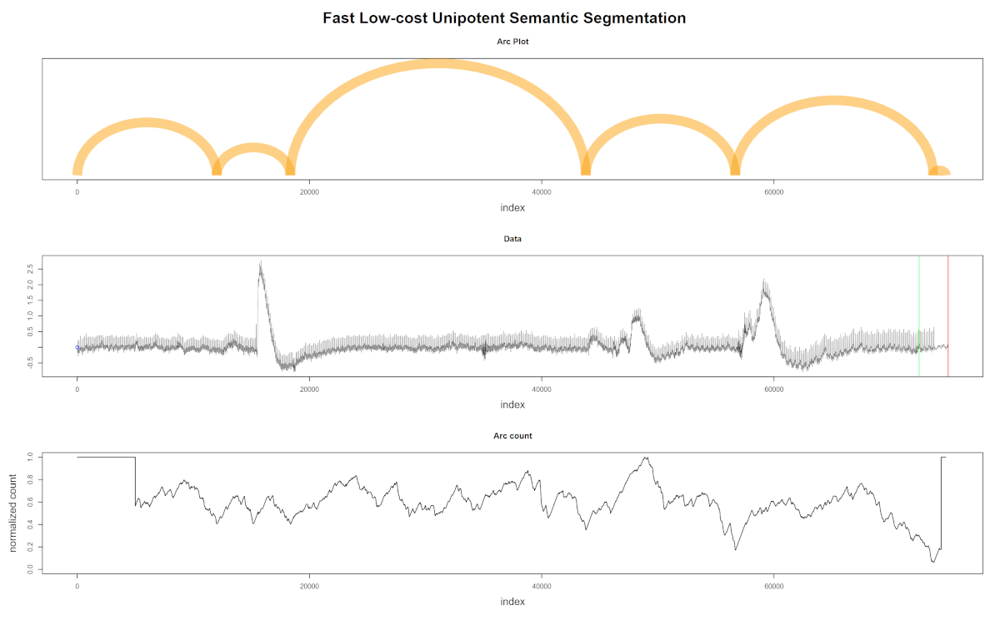

```{r setup, include=FALSE}
knitr::opts_chunk$set(
  echo = FALSE, fig.align = "center", dev = "svg", autodep = TRUE,
  tidy = "styler",
  tidy.opts = list(strict = TRUE)
)
library(tibble)
library(kableExtra)
library(here)
library(ggplot2)

.rmdenvir <- environment()
.refctr <- c(`_` = 0)

ref <- function(use_name) {
  require(stringr, quietly = TRUE)
  if (!exists(".refctr")) .refctr <- c(`_` = 0)
  if (any(names(.refctr) == use_name)) {
    return(.refctr[use_name])
  }
  type <- str_split(use_name, ":")[[1]][1]
  n_obj <- sum(str_detect(names(.refctr), type))
  use_num <- n_obj + 1
  newrefctr <- c(.refctr, use_num)
  names(newrefctr)[length(.refctr) + 1] <- use_name
  assign(".refctr", newrefctr, envir = .rmdenvir)
  return(use_num)
}
```

# Introduction

```{r pocmonitor, echo=FALSE, fig.cap=paste0("Fig. ", ref("fig:pocmonitor"), ": POC Monitor.")}
knitr::include_graphics("figures/pocmonitor.jpg")
```

::: notes
-   POC devices works "either" as plot or alarms using predefined normal trigger ranges
-   Modern devices also incorporate algorithms to analyze arrhythmias improving their specificity
:::

------------------------------------------------------------------------------------------------------------------------

```{r ecg12deriv, echo=FALSE, fig.cap=paste0("Fig. ", ref("fig:ecg12deriv"), ": 12-derivation ECG.")}
knitr::include_graphics("figures/ecg12deriv.jpg")
```

\
False alarms increases both patient and staff's stress; depending on how it is measured, the rate of false alarms
(overall) in ICU is estimated at 65 to 95% [@donchin2002].

::: notes
12-derivation ECG machines are complex

-   Both systems do not handle disconnected leads and patient's motions, being strictly necessary to have a good and
    stable signal to allow proper diagnosis.
:::

# Objectives and the research question

**AIM:** to identify, on streaming data, abnormal hearth electric patterns, specifically those which are
life-threatening, to be a reliable signal for Intensive Care Units to respond quickly to those situations.

**If possible:** It also may be able to continuously analyze new data and correct itself shutting off false alarms.

Questions:

1.  Can we reduce the number of false alarms in the ICU setting?

2.  Can we accomplish this objective using a minimalist approach (low CPU, low memory) while maintaining robustness?

3.  Can this approach be used in other health domains other than ICU or ECG?

# Related Works

The CinC/Physionet Challenge 2015 produced several papers aiming to reduce false alarms on their dataset.\

```{r alarms, echo=FALSE}
alarms <- tribble(
  ~Alarm, ~Definition,
  "Asystole", "No QRS for at least 4 seconds",
  "Extreme Bradycardia", "Heart rate lower than 40 bpm for 5 consecutive beats",
  "Extreme Tachycardia", "Heart rate higher than 140 bpm for 17 consecutive beats",
  "Ventricular Tachycardia", "5 or more ventricular beats with heart rate higher than 100 bpm",
  "Ventricular Flutter/Fibrillation", "Fibrillatory, flutter, or oscillatory waveform for at least 4 seconds"
)

kbl(alarms, booktabs = TRUE, caption = paste("Table ", ref("tab:alarms"), "- Definition of the 5 alarm types used in CinC/Physionet Challenge 2015 challenge."), align = "ll") %>%
  kable_styling(full_width = TRUE) %>%
  column_spec(1, width = "5cm") %>%
  row_spec(0, bold = TRUE)
```

::: notes
-   In Table `r ref("tab:alarms")` it is listed the five life-threatening alarms present in their dataset.
:::

------------------------------------------------------------------------------------------------------------------------

```{r scores, echo=FALSE}
challenge <- tribble(
  ~Score, ~Authors,
  81.39, "Filip Plesinger, Petr Klimes, Josef Halamek, Pavel Jurak",
  79.44, "Vignesh Kalidas",
  79.02, "Paula Couto, Ruben Ramalho, Rui Rodrigues",
  76.11, "Sibylle Fallet, Sasan Yazdani, Jean-Marc Vesin",
  75.55, "Christoph Hoog Antink, Steffen Leonhardt"
)

kbl(challenge, booktabs = TRUE, caption = paste("Table ", ref("tab:challenge"), "- Challenge Results on Streaming"), align = "cl") %>%
  kable_styling(full_width = TRUE) %>%
  column_spec(2, width = "9cm") %>%
  row_spec(0, bold = TRUE)
```

::: notes
-   In Table `r ref("tab:scores")` it is listed the top-5 Challenge Results on Streaming.
:::

# Research plan and methods

This research is being conducted using the Research Compendium principles[@compendium2019]:

```{r compendium_principles, echo=FALSE, fig.cap=paste0("Fig. ", ref("fig:compendium_principles"), ": Research Compendium principles.")}
knitr::include_graphics("figures/compendium_principles.png")
```

------------------------------------------------------------------------------------------------------------------------

Data management follows the FAIR principle (findable, accessible, interoperable, reusable)[@wilkinson2016].

```{r compendium_principles2, echo=FALSE, fig.cap=paste0("Fig. ", ref("fig:compendium_principles2"), ": FAIR principle (findable, accessible, interoperable, reusable).")}
knitr::include_graphics("figures/compendium_principles2.png")
```

------------------------------------------------------------------------------------------------------------------------

All steps of the process will be managed using the R package `targets`[@landau2021] from data extraction to the final
report, as shown in Fig. `r ref("fig:targets")`.

```{r targets, echo=FALSE, fig.cap=paste0("Fig. ", ref("fig:targets"), ": Reproducible research workflow using `targets`.")}
knitr::include_graphics("figures/targets.png")
```

------------------------------------------------------------------------------------------------------------------------

```{r workflowr_print, echo=FALSE, fig.cap=paste0("Fig. ", ref("fig:workflowr_print"), ": Reproducible research workflow using `workflowr`.")}
knitr::include_graphics("figures/workflowr_print.png")
```

------------------------------------------------------------------------------------------------------------------------

```{r session_information, echo=FALSE, fig.cap=paste0("Fig. ", ref("fig:session_information"), ": Reproducible research workflow using `workflowr`.")}
knitr::include_graphics("figures/session_information.png")
```

------------------------------------------------------------------------------------------------------------------------

```{r badges, echo=FALSE, fig.cap=paste0("Fig. ", ref("fig:badges"), ": Ready to code, versioned, code quality checked.")}
knitr::include_graphics("figures/badges.png")
```

------------------------------------------------------------------------------------------------------------------------

The dataset is publicly available at Zenodo: {style="height:1em;margin: 0 0 -0.2em 0;"}

```{r zenodo, echo=FALSE, fig.cap=paste0("Fig. ", ref("fig:zenodo"), ": FAIR principle (findable, accessible, interoperable, reusable)."), out.width='60%'}
knitr::include_graphics("figures/zenodo.png")
```

::: notes
Currently, the dataset used is stored on a public repository[@franz_dataset], the source code is publicly open and
stored on Github[@franz_github], while the reports and reproducibility information on each step is found on a public
website[@franz_website]. The current dataset and further collected data will be publicly available following the FAIR
principle.
:::

## Proposed approach

The proposed approach is depicted in Fig. `r ref("fig:workflow_image")`:

```{r workflow_image, echo=FALSE, fig.cap=paste0("Fig. ", ref("fig:workflow_image"), ": Proposed approach to train the model for relevant patterns detection.")}
knitr::include_graphics("figures/false_alarm.svg")
```

::: notes
- That is only a draft of the final workflow.
- The algorithm for the classification of the regime changes is still to be defined.
- However, the main innovation resides in the correct regime detection.
- Also, to achieve the goal of low CPU and memory usage, the strategy will be to combine fading factors[@Gama2013; @Rodrigues2010] to reduce computation in online settings like in this research.
:::

# Preliminary Experimentations

## Raw Data

While programming the pipeline for the current dataset, it has been acquired a Single Lead Heart Rate Monitor breakout
from Sparkfun^TM^ [@sparkfun2021] using the AD8232 [@AnalogDevices2020] microchip from Analog Devices Inc., compatible
with Arduino^(R)^ [@arduino2021], for an in-house experiment. Fig. `r ref("fig:ad8232")`.

```{r ad8232, echo=FALSE, fig.cap=paste0("Fig. ", ref("fig:ad8232"), ": Single Lead Heart Rate Monitor")}
knitr::include_graphics("figures/sparkfun2.jpg")
```

------------------------------------------------------------------------------------------------------------------------

The output gives us a raw signal as shown in Fig. `r ref("fig:rawsignal")`.

```{r rawsignal, echo=FALSE, fig.cap=paste0("Fig. ", ref("fig:rawsignal"), ": raw output from Arduino at ~300Hz")}
knitr::include_graphics("figures/arduino_plot.jpg")
```

After applying the same settings as the Physionet database (collecting the data at 500Hz, resample to 250Hz,
pass-filter, and notch filter), the signal is much better as shown in Fig. `r ref("fig:filtersignal")`.

```{r filtersignal, echo=FALSE, fig.cap=paste0("Fig. ", ref("fig:filtersignal"), ": Gray is raw, Red is filtered")}
knitr::include_graphics("figures/filtered_ecg.png")
```

## Data quality

At the same time, the ECG data needs to be "cleaned" for proper evaluation. That is different from the initial filtering
process. Several SQIs (Signal Quality Indexes) are used on literature [@eerikainen2015], some trivial measures as
*kurtosis*, *skewness*, median local noise level, other more complex as pcaSQI (the ratio of the sum of the five largest
eigenvalues associated with the principal components over the sum of all eigenvalues obtained by principal component
analysis applied to the time aligned ECG segments in the window). By experimentation (yet to be validated), a simple
formula gives us the "complexity" of the signal and correlates well with the noisy data is shown in Equation
$\eqref{complex}$.

$$
\sqrt{\sum_{i=1}^w((x_{i+1}-x_i)^2)}, \quad \text{where}\; w \; \text{is the window size} \tag{1} \label{complex}
$$

------------------------------------------------------------------------------------------------------------------------

The Fig. `r ref("fig:sqi")` shows some SQIs.

```{r sqi, echo=FALSE, fig.cap=paste0("Fig. ", ref("fig:sqi"), ": Green line is the \"complexity\" of the signal")}
knitr::include_graphics("figures/noise.png")
```

------------------------------------------------------------------------------------------------------------------------

Fig. `r ref("fig:regimefilter")` shows that noisy data (probably patient muscle movements) are marked with a blue point
and thus are ignored by the algorithm. Also, valid for the following plots, the green and red lines on the data mark the
10 seconds window where the "event" that triggers the alarm is supposed to happen.

```{r regimefilter, echo=FALSE, fig.cap=paste0("Fig. ", ref("fig:regimefilter"), ": Regime changes with noisy data - false alarm")}
knitr::include_graphics("figures/regime_filtered.png")
```

------------------------------------------------------------------------------------------------------------------------

In Fig. `r ref("fig:regimefalse")`, the data is clean; thus, nothing is excluded. Interestingly one of the detected
regime changes is inside the "green-red" window. But it is a false alarm.

```{r regimefalse, echo=FALSE, fig.cap=paste0("Fig. ", ref("fig:regimefalse"), ": Regime changes with good data - false alarm")}
knitr::include_graphics("figures/regime_false.png")
```

------------------------------------------------------------------------------------------------------------------------

The last plot (Fig. `r ref("fig:regimetrue")`) shows the algorithm's robustness, not excluding good data with a
wandering baseline, and the last regime change is correctly detected inside the "green-red" window.

```{r regimetrue, echo=FALSE, fig.cap=paste0("Fig. ", ref("fig:regimetrue"), ": Regime changes with good but wandering data - true alarm")}

```

# Detecting Regime Changes

Briefly describing the regime detection algorithm, which can be explored in the original paper [@gharghabi2018], it is
based on the assumption that between two regimes, the most similar shape (its nearest neighbor) is located on "the same
side". This information is obtained from the Matrix Profile computation. More precisely, using only the Profile Index.

```{r arcs_fluss_original, echo=FALSE, fig.cap=paste0("Fig. ", ref("fig:arcs_fluss_original"), ": FLUSS algorithm, using arc counts.")}
knitr::include_graphics("figures/arcs_fluss_original.png")
```

------------------------------------------------------------------------------------------------------------------------

Claims about the algorithm:

-   **Domain Agnosticism:** the algorithm makes no assumptions about the data as opposed to most available algorithms to
    date.
-   **Streaming:** the algorithm can provide real-time information.
-   **Real-World Data Suitability:** the objective is not to *explain* all the data. Therefore, areas marked as "don't
    know" areas are acceptable.
-   **FLUSS/FLOSS is not:** a change point detection algorithm [@aminikhanghahi2016]. The interest here is changes in the
    shapes of a sequence of measurements.

# Current state

A new concept was needed to be implemented on the algorithm in order to emulate (in this first iteration) the behavior
of the real-time sensor: the search must only look for previous information within a time constraint. Thus, both the
Matrix Profile computation and the *Arc Counts* needed to be adapted for this task.

## Some findings

In the original paper, in chapter 3.5, the authors of FLOSS wisely introduce the **temporal constraint**.

Nevertheless,

-   Should we use the already computed Indexes or recompute the Matrix Profile using this constraint?
-   The authors declare the correction curve typically used on FLUSS and FLOSS as "simply a uniform distribution",
    but this is not an accurate statement.
-   The original paper discards the datapoints within $(ProfileSize - constraint) \cdots ProfileSize$.

The solution for evaluating the effect of using time constraints in this work's setting was to generate
the ideal distribution using the constrained parameters beforehand. That gives us enough data to evaluate
a regime change accurately utilizing a minimum of $2 \times WindowSize$ datapoints. The best index is
still to be determined, and current tests are using 3 seconds limit.

::: notes
That is important because the output of the FLOSS algorithm should be
normalized and constrained between 0 and 1, which allows us to compare different trials using different parameters in
the process. Finally, the last datapoints are **not** irrelevant, opposed to what was stated by the authors, since an
*Online* algorithm needs to return an answer as soon as the application domain requires. That is very much relevant to
this work's field, as, for example, for asystole detection, we have a window of 4 seconds to fire the alarm. If the time
constraint is 10 seconds, this would mean (by the original article) that the last 10 seconds of the incoming data would
not be sufficient to detect the regime change.
:::

## Temporal constraint

By experimenting, we see that the original paper set the temporal constraint in the Matrix Profile
algorithm (as it seems more appropriate too). That reduces the computation time of the online Matrix
Profile, and any post-processing done afterward will inherit this constraint.
The distribution for correcting the FLOSS algorithm is also simpler. Fig. `r ref("fig:distributions")`.

```{r dist data, cache=TRUE, include=FALSE}
source(here("scripts", "common", "compute_floss.R"))

get_dist <- function(mp_const = 1250, floss_const = 0, sample_size = 5) {
  set.seed(2021)
  iac <- list()
  pro_size <- 5000
  mp_time_constraint <- mp_const
  floss_time_constraint <- floss_const
  for (i in seq.int(1, sample_size)) {
    iac[[i]] <- get_asym(pro_size, mp_time_constraint, floss_time_constraint)
  }

  aic_avg <- rowMeans(as.data.frame(iac))

  data.frame(index = 1:5000, counts = aic_avg)
}

data_5000 <- get_dist(5000)
data_4250 <- get_dist(4250)
data_2500 <- get_dist(2500)
data_1250 <- get_dist(1250)

floss_data_5000 <- get_dist(0, 5000)
floss_data_4250 <- get_dist(0, 4250)
floss_data_2500 <- get_dist(0, 2500)
floss_data_1250 <- get_dist(0, 1250)
```

```{r distributions, echo=FALSE, fig.cap=paste0("Fig. ", ref("fig:distributions"), ": 1D-IAC distributions for earlier temporal constraint (on Matrix Profile)")}

offset <- 120

floss_dist <- ggplot(data_5000, aes(index, counts)) +
  geom_line(size = 0.7) +
  ggtitle("a) No constraint") +
  theme_grey(base_size = 15)

floss_4250 <- ggplot(data_4250, aes(index, counts)) +
  geom_line(size = 0.7) +
  ggtitle("b) Constraint of 4250") +
  theme_grey(base_size = 15)

floss_2500 <- ggplot(data_2500, aes(index, counts)) +
  geom_line(size = 0.7) +
  annotate("segment", y = 0, yend = max(data_2500$counts), x = 2500, xend = 2500, linetype = 2, size = 0.7) +
  annotate("text", x = 2500 - offset, y = 40, label = "start", color = "black", size = 6, angle = 90, hjust = 0) +
  annotate("segment", y = 0, yend = max(data_2500$counts), x = 5000 - 2500 * 0.9, xend = 5000 - 2500 * 0.9, linetype = 2, size = 0.7) +
  annotate("text", x = 5000 - 2500 * 0.9 - offset, y = 40, label = "end", color = "black", size = 6, angle = 90, hjust = 0) +
  ggtitle("c) Constraint of 2500") +
  theme_grey(base_size = 15)

floss_1250 <- ggplot(data_1250, aes(index, counts)) +
  geom_line(size = 0.7) +
  annotate("segment", y = 0, yend = max(data_1250$counts), x = 1250, xend = 1250, linetype = 2, size = 0.7) +
  annotate("text", x = 1250 - offset, y = 40, label = "start", color = "black", size = 6, angle = 90, hjust = 0) +
  annotate("segment", y = 0, yend = max(data_1250$counts), x = 5000 - 1250 * 0.9, xend = 5000 - 1250 * 0.9, linetype = 2, size = 0.7) +
  annotate("text", x = 5000 - 1250 * 0.9 - offset, y = 40, label = "end", color = "black", size = 6, angle = 90, hjust = 0) +
  ggtitle("d) Constraint of 1250") +
  theme_grey(base_size = 15)

gg <- gridExtra::grid.arrange(floss_dist, floss_4250, floss_2500, floss_1250,
  nrow = 2, newpage = TRUE,
  bottom = grid::textGrob(paste("The plot a) shows the distribution used for the arc count correction when there is no time constraint.", "\n", "b) Shows a constraint of 3/4 of the total. c) 1/2 of the total. d) 1/4 of the total; here we see clearly the flat line.", "\n", "The dashed line marks the start and the end of the uniform zone."), just = "center", gp = grid::gpar(fontsize = 15))
)
```

------------------------------------------------------------------------------------------------------------------------

On the other hand, it is possible to apply the time constraint in the FLOSS algorithm, leaving the online Matrix Profile
in its original form. See Fig. `r ref("fig:floss_dist")`. The theoretical distribution changes significantly according to
the constraint value.

```{r floss_dist, echo=FALSE, fig.cap=paste0("Fig. ", ref("fig:floss_dist"), ": 1D-IAC distributions for later temporal constraint (on FLOSS)")}

offset <- 120

floss_dist <- ggplot(floss_data_5000, aes(index, counts)) +
  geom_line(size = 0.7) +
  ggtitle("a) No constraint") +
  theme_grey(base_size = 15)

floss_4250 <- ggplot(floss_data_4250, aes(index, counts)) +
  geom_line(size = 0.7) +
  ggtitle("b) Constraint of 4250") +
  theme_grey(base_size = 15)

floss_2500 <- ggplot(floss_data_2500, aes(index, counts)) +
  geom_line(size = 0.7) +
  annotate("segment", y = 0, yend = max(data_2500$counts), x = 2500, xend = 2500, linetype = 3, size = 0.7) +
  annotate("text", x = 2500 - offset, y = 40, label = "start", color = "black", size = 6, angle = 90, hjust = 0) +
  annotate("segment", y = 0, yend = max(data_2500$counts), x = 5000 - 2500 * 0.9, xend = 5000 - 2500 * 0.9, linetype = 3, size = 0.7) +
  annotate("text", x = 5000 - 2500 * 0.9 - offset, y = 40, label = "end", color = "black", size = 6, angle = 90, hjust = 0) +
  ggtitle("c) Constraint of 2500") +
  theme_grey(base_size = 15)

floss_1250 <- ggplot(floss_data_1250, aes(index, counts)) +
  geom_line(size = 0.7) +
  annotate("segment", y = 0, yend = max(data_1250$counts), x = 1250, xend = 1250, linetype = 3, size = 0.7) +
  annotate("text", x = 1250 - offset, y = 40, label = "start", color = "black", size = 6, angle = 90, hjust = 0) +
  annotate("segment", y = 0, yend = max(data_1250$counts), x = 5000 - 1250 * 0.9, xend = 5000 - 1250 * 0.9, linetype = 3, size = 0.7) +
  annotate("text", x = 5000 - 1250 * 0.9 - offset, y = 40, label = "end", color = "black", size = 6, angle = 90, hjust = 0) +
  ggtitle("d) Constraint of 1250") +
  theme_grey(base_size = 15)

gg <- gridExtra::grid.arrange(floss_dist, floss_4250, floss_2500, floss_1250,
  nrow = 2, newpage = TRUE,
  bottom = grid::textGrob(paste("The plot a) shows the distribution used for the arc count correction when there is no time constraint.", "\n", "b) Shows a constraint of 3/4 of the total. c) 1/2 of the total. d) 1/4 of the total; here we see clearly the flat line.", "\n", "The dotted line marks the start and the end of the uniform zone if using the constraint in the Matrix Profile."), just = "center", gp = grid::gpar(fontsize = 15))
)
```

::: notes
The upside of this approach, at least during the prospective phase, is to allow us to decide the time constraint
value later in the pipeline, avoiding the recomputation of the Matrix Profile. The results on detecting regime
changes are very similar to the first approach.
:::


------------------------------------------------------------------------------------------------------------------------

The results on detecting regime changes are very similar in both cases. Fig. `r ref("fig:constraints")`.


```{r output_data, cache=TRUE, include=FALSE}
output <- readRDS(here("output/work_output.rds"))
mp_data <- output$mp_constraint[[1]]$II[[76]]
mp_data <- tibble(time = seq_along(mp_data$cac), cac = mp_data$cac, iac = mp_data$iac, arcs = mp_data$arcs)
floss_data <- output$floss_constraint[[1]]$II[[76]]
floss_data <- tibble(time = seq_along(floss_data$cac), cac = floss_data$cac, iac = floss_data$iac, arcs = floss_data$arcs)
# rm(output)
```


```{r constraints, echo=FALSE, fig.cap=paste0("Fig. ", ref("fig:constraints"), ": CAC and Regime detection using early and later IAC")}

landmark <- 5000 - 3 * 250
mp_cac_landmark <- mp_data$cac[landmark]
floss_cac_landmark <- floss_data$cac[landmark]

mp_constraint <- ggplot(mp_data, aes(time, cac)) +
  geom_line(size = 0.7) +
  ylim(0, 1) +
  ylab("CAC") +
  xlab("") +
  annotate("segment", y = 0, yend = 1, x = landmark, xend = landmark, linetype = 1, size = 0.7, color = "red") +
  annotate("text", x = landmark, y = mp_cac_landmark, label = sprintf("%.2f", mp_cac_landmark), color = "red", size = 6, vjust = 0, hjust = -0.2) +
  ggtitle("a) Constraint of 1250 on Matrix Profile") +
  theme_grey(base_size = 15)

floss_constraint <- ggplot(floss_data, aes(time, cac)) +
  geom_line(size = 0.7) +
  ylim(0, 1) +
  ylab("") +
  xlab("") +
  annotate("segment", y = 0, yend = 1, x = landmark, xend = landmark, linetype = 1, size = 0.7, color = "red") +
  annotate("text", x = landmark, y = floss_cac_landmark, label = sprintf("%.2f", floss_cac_landmark), color = "red", size = 6, vjust = 0, hjust = -0.2) +
  ggtitle("b) Constraint of 1250 on FLOSS") +
  theme_grey(base_size = 15)

mp_arcs <- ggplot(mp_data, aes(time, arcs)) +
  geom_line(size = 0.7) +
  geom_line(aes(time, iac), size = 0.7, color = "red") +
  ylab("Arcs and IAC") +
  annotate("segment", y = 0, yend = 900, x = 1250, xend = 1250, linetype = 3, size = 0.7) +
  annotate("segment", y = 0, yend = 900, x = 5000 - 1250 * 0.9, xend = 5000 - 1250 * 0.9, linetype = 3, size = 0.7) +
  theme_grey(base_size = 15)

floss_arcs <- ggplot(floss_data, aes(time, arcs)) +
  geom_line(size = 0.7) +
  geom_line(aes(time, iac), size = 0.7, color = "red") +
  ylab("") +
  annotate("segment", y = 0, yend = 800, x = 1250, xend = 1250, linetype = 3, size = 0.7) +
  annotate("segment", y = 0, yend = 800, x = 5000 - 1250 * 0.9, xend = 5000 - 1250 * 0.9, linetype = 3, size = 0.7) +
  theme_grey(base_size = 15)


gg <- gridExtra::grid.arrange(mp_constraint, floss_constraint, mp_arcs, floss_arcs,
  nrow = 2, newpage = TRUE,
  bottom = grid::textGrob(paste(
    "The plots on a) show above the Corrected Arc Count (CAC) and below the raw arc counts (black) and the\n",
    "ideal arc count (IAC) (red) using the temporal constraint earlier on the Matrix Profile.\n",
    "The plots on b) show above the Corrected Arc Count (CAC) and below the raw arc counts (black) and\n",
    "the ideal arc count (IAC) (red) using the temporal constraint later on the FLOSS algorithm.\n",
    "The red vertical line marks the point where the current algorithm watches for regime changes."
  ),
  just = "center", gp = grid::gpar(fontsize = 15)
  )
)
```

# One more contributiono

Since the first Matrix Profile computation algorithm, the STAMP [@yeh2016], several improvements on the algorithm were
made [@zhu2016; @zhu2018]. Still, the ability to keep a growing Matrix Profile (i.e., *Online*) relies on the STAMP
algorithm. If the problem allows collecting several data points (chunks), STOMP [@zhu2016] can speed up the computation.
Curiously, the main bottleneck of all these algorithms is the FFT (Fast Fourier Transform) algorithm that is the core of
the MASS algorithm published by Mueen *et al.* [@mueen2010] in 2010 and later in 2015, having its code released on
Professor Mueen's webpage [@mass2015]. The FFT libraries available are highly optimized and CPU (or GPU) dependent what
makes it at the same time fast but brittle and not suitable for MCU's (Microcontroller Unit), for example. More
interestingly yet, is the fact that several published works using Matrix Profile, MPdist [@gharghabi2018a], for
instance, uses an unpublished algorithm called 'MPX' that computes the Matrix Profile using cross-correlation methods
ending up faster and is easily portable.

This work contributes to extending the MPX algorithm to allow the *Online* computation of the Matrix Profile. More
precisely, we are interested in the Right Matrix Profile, whose updated indexes refer only to the last incoming
datapoint, since we are looking for future changes in the regime, not looking backward. This one-directional algorithm
is already described in the FLOSS paper [@gharghabi2018].

------------------------------------------------------------------------------------------------------------------------

Another contribution of this work is an unexplored constraint that we could apply on building the Matrix Profile that we
will call *Similarity Threshold* (ST). The original work outputs the similarity values in Euclidean Distance (ED)
values, while MPX naturally outputs the values in Pearson's correlation (CC) coefficients. Both ED and CC are
interchangeable using the equation $\eqref{edcc}$. However, we may argue that it is easier to compare values that do not
depend on the $WindowSize$ during an exploratory phase. MPX happens to naturally return values in CC, saving a few more
computation time.

$$
CC = 1 - \frac{ED}{(2 \times WindowSize)} \tag{2} \label{edcc}
$$

The ST is an interesting factor that we can use, especially when detecting pattern changes during time. The FLUSS/FLOSS
algorithms rely on counting references between indexes in the time series. ST can help remove "noise" from these
references since only similar patterns above a certain threshold are referenced, and changes have more impact on these
counts. More information and visual content on ST will be provided later. The best ST threshold is still to be
determined.

# Further Steps

-   Explanation on the evaluation method for regime change detection (as described in the FLOSS paper [@gharghabi2018] )
-   Extraction of regime samples and classification of `TRUE` or `FALSE` for Asystole
-   Cross-validation and evaluation of the algorithm
-   Publish results

# References

::: {#refs}
:::

