```{r setup, include=FALSE}
knitr::opts_chunk$set(
  echo = FALSE, fig.align = "center", dev = "svg", autodep = TRUE,
  tidy = "styler",
  tidy.opts = list(strict = TRUE)
)

library(tibble)
library(kableExtra)
library(here)
library(ggplot2)

.rmdenvir <- environment()
.refctr <- c(`_` = 0)

ref <- function(use_name) {
  require(stringr, quietly = TRUE)
  if (!exists(".refctr")) .refctr <- c(`_` = 0)
  if (any(names(.refctr) == use_name)) {
    return(.refctr[use_name])
  }
  type <- str_split(use_name, ":")[[1]][1]
  n_obj <- sum(str_detect(names(.refctr), type))
  use_num <- n_obj + 1
  newrefctr <- c(.refctr, use_num)
  names(newrefctr)[length(.refctr) + 1] <- use_name
  assign(".refctr", newrefctr, envir = .rmdenvir)
  return(use_num)
}
```

# Introduction

```{r pocmonitor, echo=FALSE, fig.cap=paste0("Fig. ", ref("fig:pocmonitor"), ": POC Monitor.")}
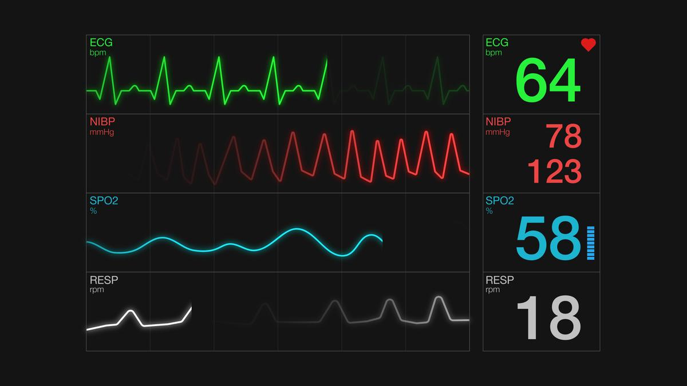
```

::: notes
::: {style="font-size:0.9em"}
-   POC devices works "either" as plot or alarms using predefined normal trigger ranges
-   Modern devices also incorporate algorithms to analyze arrhythmias improving their specificity
:::
:::

------------------------------------------------------------------------------------------------------------------------

```{r ecg12deriv, echo=FALSE, fig.cap=paste0("Fig. ", ref("fig:ecg12deriv"), ": 12-derivation ECG.")}

```

\

False alarms increases both patient and staff's stress; depending on how it is measured, the rate of false alarms
(overall) in ICU is estimated at 65 to 95% [@donchin2002].

::: notes
::: {style="font-size:0.9em"}
12-derivation ECG machines are complex

-   Both systems do not handle disconnected leads and patient's motions, being strictly necessary to have a good and
    stable signal to allow proper diagnosis.
:::
:::

# Objectives and the research question

-   **AIM:** to identify, on streaming data, abnormal hearth electric patterns, specifically those which are
    life-threatening, to be a reliable signal for Intensive Care Units to respond quickly to those situations.

-   **If possible:** It also may be able to continuously analyze new data and correct itself shutting off false alarms.

-   **Questions:**

    1.  Can we reduce the number of false alarms in the ICU setting?

    2.  Can we accomplish this objective using a minimalist approach (low CPU, low memory) while maintaining robustness?

    3.  Can this approach be used in other health domains other than ICU or ECG?

# Related Works

::: {style="text-align: center;"}
The CinC/Physionet Challenge 2015 produced several papers\
aiming to reduce false alarms on their dataset. Table `r ref("tab:alarms")`.\
\
:::

```{r alarms, echo=FALSE}
alarms <- tribble(
  ~Alarm, ~Definition,
  "Asystole", "No QRS for at least 4 seconds",
  "Extreme Bradycardia", "Heart rate lower than 40 bpm for 5 consecutive beats",
  "Extreme Tachycardia", "Heart rate higher than 140 bpm for 17 consecutive beats",
  "Ventricular Tachycardia", "5 or more ventricular beats with heart rate higher than 100 bpm",
  "Ventricular Flutter/Fibrillation", "Fibrillatory, flutter, or oscillatory waveform for at least 4 seconds"
)

kbl(alarms, booktabs = TRUE, caption = paste("Table ", ref("tab:alarms"), "- Definition of the 5 alarm types used in CinC/Physionet Challenge 2015 challenge."), align = "ll") |>
  kable_styling(full_width = TRUE)
```

::: notes
::: {style="font-size:0.9em"}
-   In Table `r ref("tab:alarms")` it is listed the five life-threatening alarms present in their dataset.
:::
:::

------------------------------------------------------------------------------------------------------------------------

```{r scores, echo=FALSE}
challenge <- tribble(
  ~Score, ~Authors,
  81.39, "Filip Plesinger, Petr Klimes, Josef Halamek, Pavel Jurak",
  79.44, "Vignesh Kalidas",
  79.02, "Paula Couto, Ruben Ramalho, Rui Rodrigues",
  76.11, "Sibylle Fallet, Sasan Yazdani, Jean-Marc Vesin",
  75.55, "Christoph Hoog Antink, Steffen Leonhardt"
)

kbl(challenge, booktabs = TRUE, caption = paste("Table ", ref("tab:challenge"), "- Challenge Results on Streaming"), align = "cl") |>
  kable_styling(full_width = TRUE) |>
  column_spec(2, width = "9cm")
```

\

$$
Score = \frac{TP+TN}{TP+TN+FP+5*FN}
$$

::: notes
::: {style="font-size:0.9em"}
-   In Table `r ref("tab:scores")` it is listed the top-5 Challenge Results on Streaming.
:::
:::

# Research plan and methods

This research is being conducted using the Research Compendium principles[@compendium2019]:

```{r compendium_principles, echo=FALSE, fig.cap=paste0("Fig. ", ref("fig:compendium_principles"), ": Research Compendium principles.")}
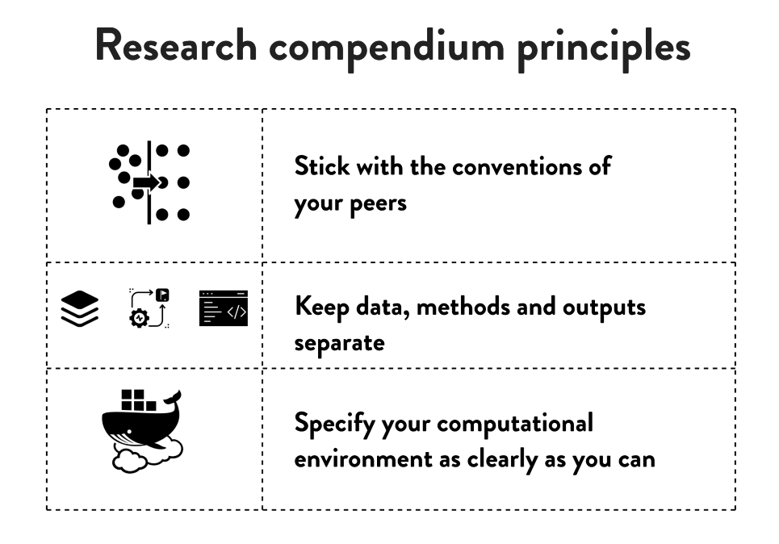
```

------------------------------------------------------------------------------------------------------------------------

Data management follows the FAIR principle (findable, accessible, interoperable, reusable)[@wilkinson2016]. Concerning
these principles, the dataset was converted from Matlab's format to CSV format, allowing more interoperability.
Additionally, all the project, including the dataset, is in conformity with the Codemeta Project [@CodeMeta2017].

```{r compendium_principles2, echo=FALSE, fig.cap=paste0("Fig. ", ref("fig:compendium_principles2"), ": FAIR principle (findable, accessible, interoperable, reusable).")}

```

------------------------------------------------------------------------------------------------------------------------

All steps of the process will be managed using the R package `targets`[@landau2021] from data extraction to the final
report, as shown in Fig. `r ref("fig:targets")`.

```{r targets, echo=FALSE, fig.cap=paste0("Fig. ", ref("fig:targets"), ": Reproducible research workflow using `targets`.")}
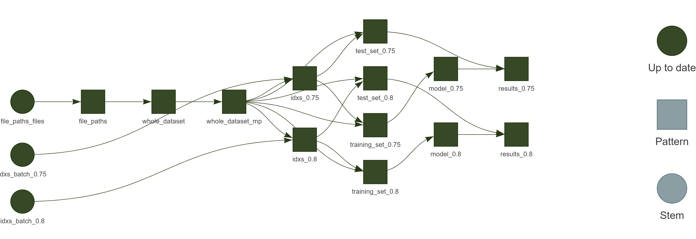
```

------------------------------------------------------------------------------------------------------------------------

```{r workflowr_print, echo=FALSE, fig.cap=paste0("Fig. ", ref("fig:workflowr_print"), ": Reproducible research workflow using `workflowr`.")}
knitr::include_graphics("figures/workflowr_print.png")
```

------------------------------------------------------------------------------------------------------------------------

```{r session_information, echo=FALSE, fig.cap=paste0("Fig. ", ref("fig:session_information"), ": Reproducible research workflow using `workflowr`.")}
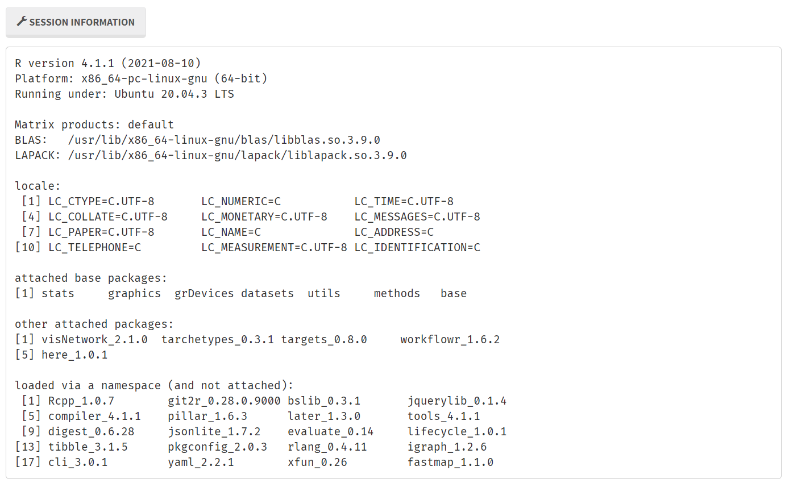
```

------------------------------------------------------------------------------------------------------------------------

```{r badges, echo=FALSE, fig.cap=paste0("Fig. ", ref("fig:badges"), ": Ready to code, versioned, code quality checked.")}
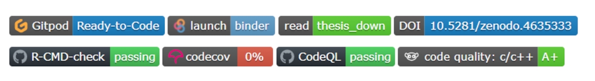
```

------------------------------------------------------------------------------------------------------------------------

The dataset is publicly available at Zenodo: {style="height:1em;margin: 0 0 -0.2em 0;"}

```{r zenodo, echo=FALSE, fig.cap=paste0("Fig. ", ref("fig:zenodo"), ": FAIR principle (findable, accessible, interoperable, reusable)."), out.width='60%'}

```

::: notes
::: {style="font-size:0.9em"}
Currently, the dataset used is stored on a public repository[@franz_dataset], the source code is publicly open and
stored on Github[@franz_github], while the reports and reproducibility information on each step is found on a public
website[@franz_website]. The current dataset and further collected data will be publicly available following the FAIR
principle.
:::
:::

## Proposed approach

The proposed approach is depicted in Figs. `r ref("fig:regimedetection")`, `r ref("fig:shapelets")` and
`r ref("fig:fullmodel")`

```{r regimedetection, echo=FALSE, out.width="90%", fig.cap=paste("Figure", ref("fig:regimedetection"), "- Pipeline for regime change detection")}
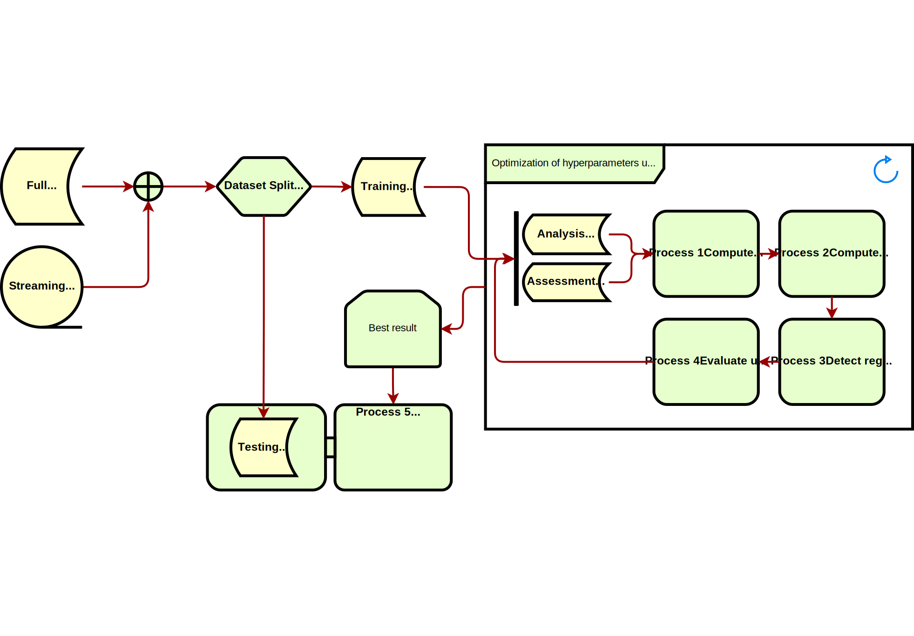
```

------------------------------------------------------------------------------------------------------------------------

```{r shapelets, echo=FALSE, out.width="60%", fig.cap=paste("Figure", ref("fig:shapelets"), "- Pipeline for TRUE and FALSE alarm classification")}
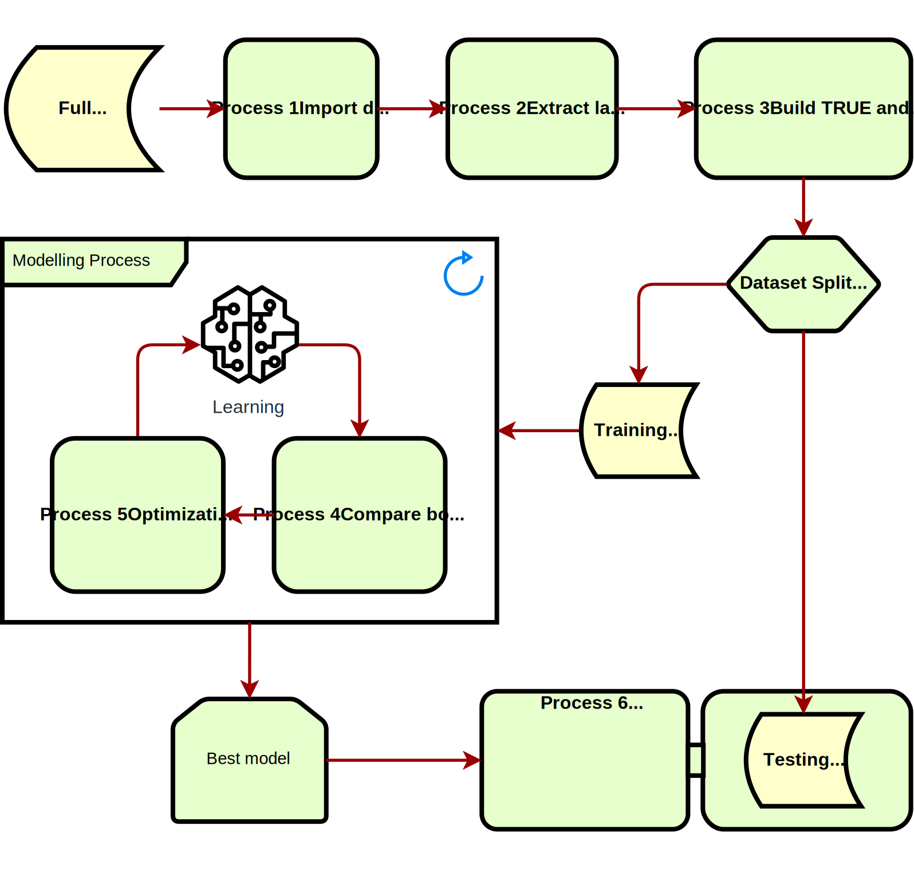
```

------------------------------------------------------------------------------------------------------------------------

```{r fullmodel, echo=FALSE, out.width="60%", fig.cap=paste("Figure", ref("fig:fullmodel"), "- Pipeline of the final process")}
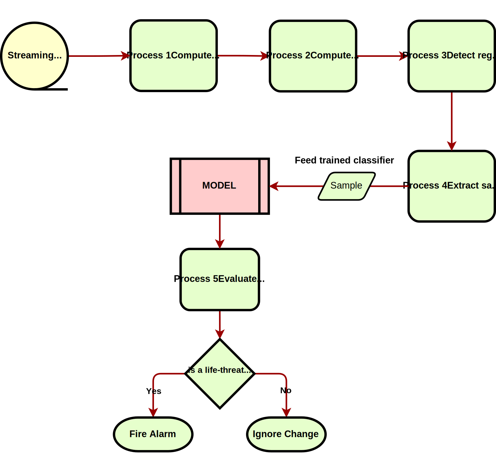
```

::: notes
::: {style="font-size:0.9em"}
-   That is only a draft of the final workflow.
-   The algorithm for the classification of the regime changes is still to be defined.
-   However, the main innovation resides in the correct regime detection.
-   Also, to achieve the goal of low CPU and memory usage, the strategy will be to combine fading factors[@Gama2013;
    @Rodrigues2010] to reduce computation in online settings like in this research.
:::
:::

# Preliminary Experimentations

## Raw Data

While programming the pipeline for the current dataset, it has been acquired a Single Lead Heart Rate Monitor breakout
from Sparkfun™ [@sparkfun2021] using the AD8232 [@AnalogDevices2020] microchip from Analog Devices Inc., compatible with
Arduino® [@arduino2021], for an in-house experiment. Fig. `r ref("fig:ad8232")`.

```{r ad8232, echo=FALSE, fig.cap=paste0("Fig. ", ref("fig:ad8232"), ": Single Lead Heart Rate Monitor")}
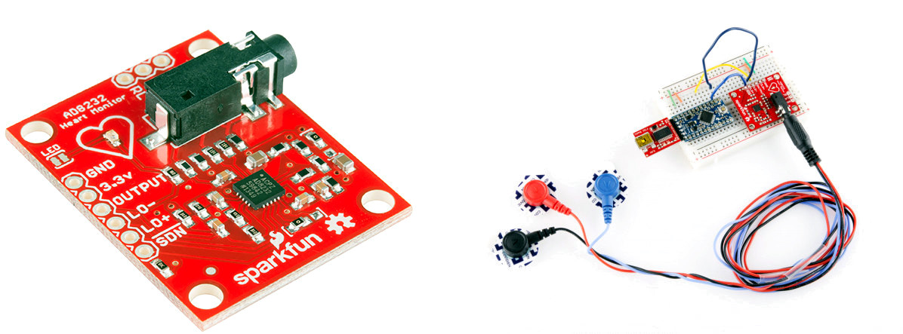
```

------------------------------------------------------------------------------------------------------------------------

The output gives us a raw signal as shown in Fig. `r ref("fig:rawsignal")`.

```{r rawsignal, echo=FALSE, fig.cap=paste0("Fig. ", ref("fig:rawsignal"), ": raw output from Arduino at ~300Hz")}
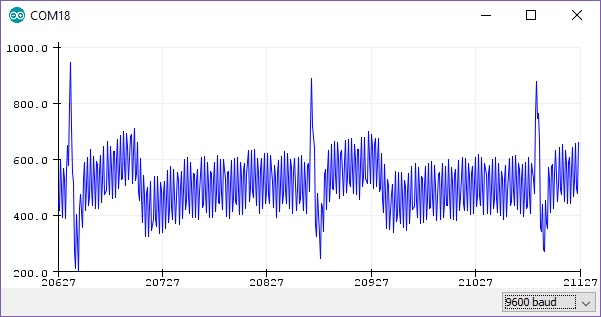
```

After applying the same settings as the Physionet database (collecting the data at 500Hz, resample to 250Hz,
pass-filter, and notch filter), the signal is much better as shown in Fig. `r ref("fig:filtersignal")`.

```{r filtersignal, echo=FALSE, fig.cap=paste0("Fig. ", ref("fig:filtersignal"), ": Gray is raw, Red is filtered")}
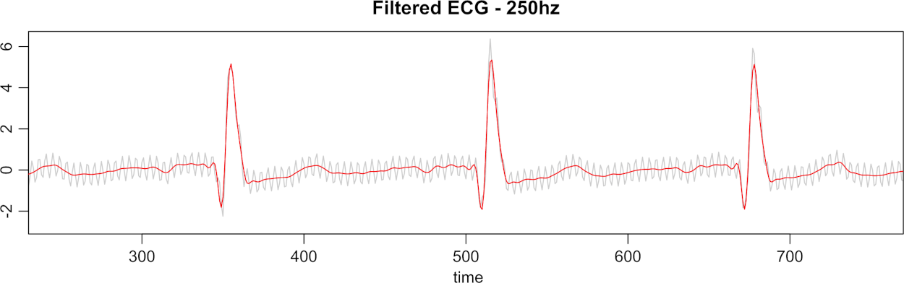
```

## Data quality

At the same time, the ECG data needs to be "cleaned" for proper evaluation. That is different from the initial filtering
process. Several SQIs (Signal Quality Indexes) are used on literature [@eerikainen2015], some trivial measures as
*kurtosis*, *skewness*, median local noise level, other more complex as pcaSQI ([the ratio of the sum of the five
largest eigenvalues associated with the principal components over the sum of all eigenvalues obtained by principal
component analysis applied to the time aligned ECG segments in the window]{.ul}, 😓). By experimentation (yet to be
validated), a simple formula gives us the **"complexity"** of the signal and correlates well with the noisy data is
shown in Equation $\eqref{complex}$.

$$
\sqrt{\sum_{i=1}^w((x_{i+1}-x_i)^2)}, \quad \text{where}\; w \; \text{is the window size} \tag{1} \label{complex}
$$

------------------------------------------------------------------------------------------------------------------------

The Fig. `r ref("fig:sqi")` shows some SQIs.

```{r sqi, echo=FALSE, fig.cap=paste0("Fig. ", ref("fig:sqi"), ": Green line is the \"complexity\" of the signal")}
knitr::include_graphics("figures/noise.png")
```

------------------------------------------------------------------------------------------------------------------------

Fig. `r ref("fig:regimefilter")` shows that noisy data (probably patient muscle movements) are marked with a blue point
and thus are ignored by the algorithm. Also, valid for the following plots, the green and red lines on the data mark the
10 seconds window where the "event" that triggers the alarm is supposed to happen.

```{r regimefilter, echo=FALSE, fig.cap=paste0("Fig. ", ref("fig:regimefilter"), ": Regime changes with noisy data - false alarm")}
knitr::include_graphics("figures/regime_filtered.png")
```

------------------------------------------------------------------------------------------------------------------------

In Fig. `r ref("fig:regimefalse")`, the data is clean; thus, nothing is excluded. Interestingly one of the detected
regime changes is inside the "green-red" window. But it is a false alarm.

```{r regimefalse, echo=FALSE, fig.cap=paste0("Fig. ", ref("fig:regimefalse"), ": Regime changes with good data - false alarm")}
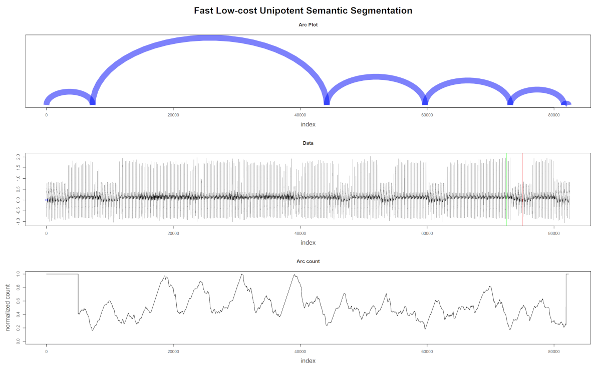
```

------------------------------------------------------------------------------------------------------------------------

The last plot (Fig. `r ref("fig:regimetrue")`) shows the algorithm's robustness, not excluding good data with a
wandering baseline, and the last regime change is correctly detected inside the "green-red" window.

```{r regimetrue, echo=FALSE, fig.cap=paste0("Fig. ", ref("fig:regimetrue"), ": Regime changes with good but wandering data - true alarm")}
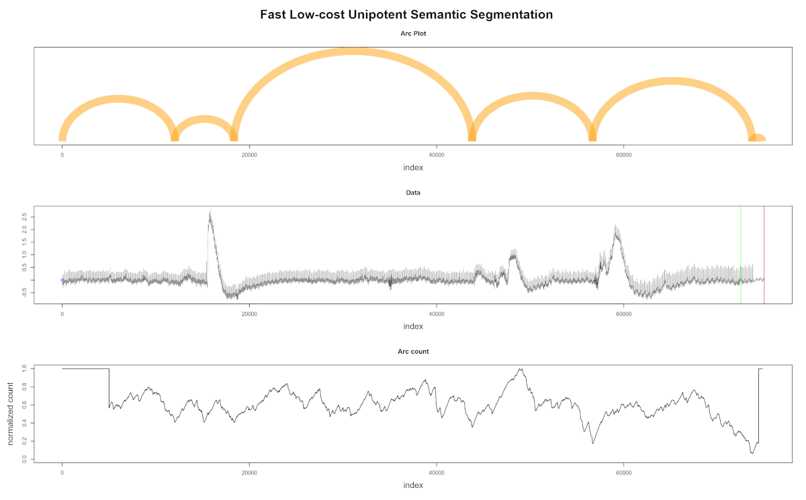
```

# Detecting Regime Changes

Briefly describing the regime detection algorithm, which can be explored in the original paper [@gharghabi2018], it is
based on the assumption that between two regimes, the most similar shape (its nearest neighbor) is located on "the same
side". This information is obtained from the Matrix Profile computation. More precisely, using only the Profile Index.

```{r arcs_fluss_original, echo=FALSE, fig.cap=paste0("Fig. ", ref("fig:arcs_fluss_original"), ": FLUSS algorithm, using arc counts.")}
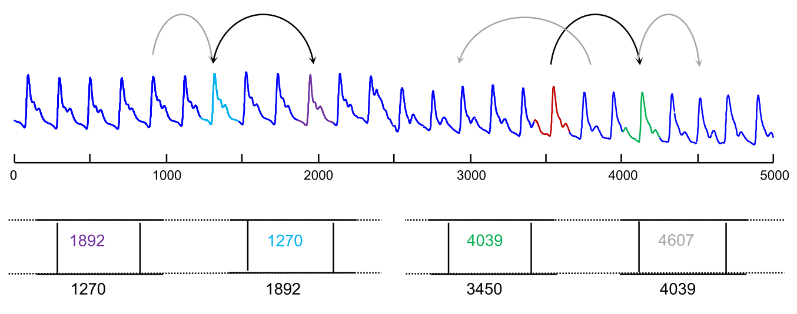
```

------------------------------------------------------------------------------------------------------------------------

Claims about the algorithm:

-   **Domain Agnosticism:** the algorithm makes no assumptions about the data as opposed to most available algorithms to
    date.
-   **Streaming:** the algorithm can provide real-time information.
-   **Real-World Data Suitability:** the objective is not to *explain* all the data. Therefore, areas marked as "don't
    know" areas are acceptable.
-   **FLOSS is not:** a change point detection algorithm [@aminikhanghahi2016]. The interest here is changes in the
    shapes of a sequence of measurements.

## Current state

One example:

```{r regime, echo=FALSE, fig.cap=paste0("Fig. ", ref("fig:regime"), ": Regime change detection example.")}
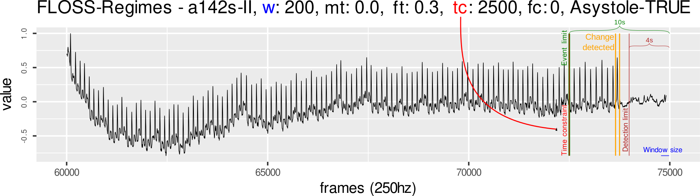
```

------------------------------------------------------------------------------------------------------------------------

The Online algorithm (FLOSS) considers only the arcs pointing forward.

One change to the algorithm is the **temporal constraint** that allows to detect repeated and short-time regimes:

```{r forward_profile, echo=FALSE, fig.cap=paste0("Fig. ", ref("fig:forward_profile"), ": FLOSS with temporal constraint.")}
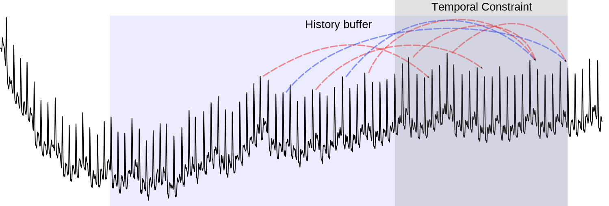
```

## Some findings

In the original paper, in chapter 3.5, the authors of FLOSS wisely introduce the **temporal constraint**.

Nevertheless,

-   The authors declare the correction curve typically used on FLOSS as "simply a uniform distribution", but this is not
    an accurate statement.
-   The original paper discards the datapoints within $(ProfileSize - constraint) \cdots ProfileSize$.

. . .

\

```{r regime_again, echo=FALSE, fig.cap=paste0("Fig. ", ref("fig:regime"), ": Regime change detection example.")}

```

::: notes
::: {style="font-size:0.9em"}
That is important because the output of the FLOSS algorithm should be normalized and constrained between 0 and 1, which
allows us to compare different trials using different parameters in the process. Finally, the last datapoints are
**not** irrelevant, opposed to what was stated by the authors, since an *Online* algorithm needs to return an answer as
soon as the application domain requires. That is very much relevant to this work's field, as, for example, for asystole
detection, we have a window of 4 seconds to fire the alarm. If the time constraint is 10 seconds, this would mean (by
the original article) that the last 10 seconds of the incoming data would not be sufficient to detect the regime change.
:::
:::

## Temporal constraint correction

The solution for evaluating the effect of using time constraints in this work's setting was to generate the ideal
distribution using the constrained parameters beforehand. That gives us enough data to evaluate a regime change
accurately utilizing a minimum of $2 \times WindowSize$ datapoints. The best index is still to be determined, and
current tests are using 3 seconds limit. Fig. `r ref("fig:distributions")`.

```{r dist data, cache=TRUE, include=FALSE}
source(here("scripts", "common", "compute_floss.R"))

get_dist <- function(mp_const = 1250, floss_const = 0, sample_size = 1000) {
  set.seed(2021)
  iac <- list()
  pro_size <- 5000
  mp_time_constraint <- mp_const
  floss_time_constraint <- floss_const
  for (i in seq.int(1, sample_size)) {
    iac[[i]] <- get_asym(pro_size, mp_time_constraint, floss_time_constraint)
  }

  aic_avg <- rowMeans(as.data.frame(iac))

  data.frame(index = 1:5000, counts = aic_avg)
}

data_5000 <- get_dist(5000)
data_4250 <- get_dist(4250)
data_2500 <- get_dist(2500)
data_1250 <- get_dist(1250)

floss_data_5000 <- get_dist(0, 5000)
floss_data_4250 <- get_dist(0, 4250)
floss_data_2500 <- get_dist(0, 2500)
floss_data_1250 <- get_dist(0, 1250)
```

```{r distributions, echo=FALSE, fig.cap=paste0("Fig. ", ref("fig:distributions"), ": 1D-Ideal Arc Counts (IAC) distributions for temporal constraint")}
offset <- 120

floss_dist <- ggplot(data_5000, aes(index, counts)) +
  geom_line(size = 0.7) +
  ggtitle("a) No constraint") +
  theme_grey(base_size = 15)

floss_4250 <- ggplot(data_4250, aes(index, counts)) +
  geom_line(size = 0.7) +
  ggtitle("b) Constraint of 4250") +
  theme_grey(base_size = 15)

floss_2500 <- ggplot(data_2500, aes(index, counts)) +
  geom_line(size = 0.7) +
  annotate("segment", y = 0, yend = max(data_2500$counts), x = 2500, xend = 2500, linetype = 2, size = 0.7) +
  annotate("text", x = 2500 - offset, y = 40, label = "start", color = "black", size = 6, angle = 90, hjust = 0) +
  annotate("segment", y = 0, yend = max(data_2500$counts), x = 5000 - 2500 * 0.9, xend = 5000 - 2500 * 0.9, linetype = 2, size = 0.7) +
  annotate("text", x = 5000 - 2500 * 0.9 - offset, y = 40, label = "end", color = "black", size = 6, angle = 90, hjust = 0) +
  ggtitle("c) Constraint of 2500") +
  theme_grey(base_size = 15)

floss_1250 <- ggplot(data_1250, aes(index, counts)) +
  geom_line(size = 0.7) +
  annotate("segment", y = 0, yend = max(data_1250$counts), x = 1250, xend = 1250, linetype = 2, size = 0.7) +
  annotate("text", x = 1250 - offset, y = 40, label = "start", color = "black", size = 6, angle = 90, hjust = 0) +
  annotate("segment", y = 0, yend = max(data_1250$counts), x = 5000 - 1250 * 0.9, xend = 5000 - 1250 * 0.9, linetype = 2, size = 0.7) +
  annotate("text", x = 5000 - 1250 * 0.9 - offset, y = 40, label = "end", color = "black", size = 6, angle = 90, hjust = 0) +
  ggtitle("d) Constraint of 1250") +
  theme_grey(base_size = 15)

gg <- gridExtra::grid.arrange(floss_dist, floss_4250, floss_2500, floss_1250,
  nrow = 2, newpage = TRUE,
  bottom = grid::textGrob(paste("The plot a) shows the distribution used for the arc count correction when there is no time constraint.", "\n", "b) Shows a constraint of 3/4 of the total. c) 1/2 of the total. d) 1/4 of the total; here we see clearly the flat line.", "\n", "The dashed line marks the start and the end of the uniform zone."), just = "center", gp = grid::gpar(fontsize = 15))
)
```

## Similarity Threshold (ST)

The ST is an interesting factor that we can use, especially when detecting pattern changes during time. The FLOSS
algorithms rely on counting references between indexes in the time series. ST can help remove "noise" from these
references since only similar patterns above a certain threshold are referenced, and changes have more impact on these
counts. More information and visual content on ST will be provided later. The best ST threshold is still to be
determined.

```{r similarity, echo=FALSE, fig.cap=paste0("Fig. ", ref("fig:similarity"), ": Example of similar patterns."), out.width='50%'}
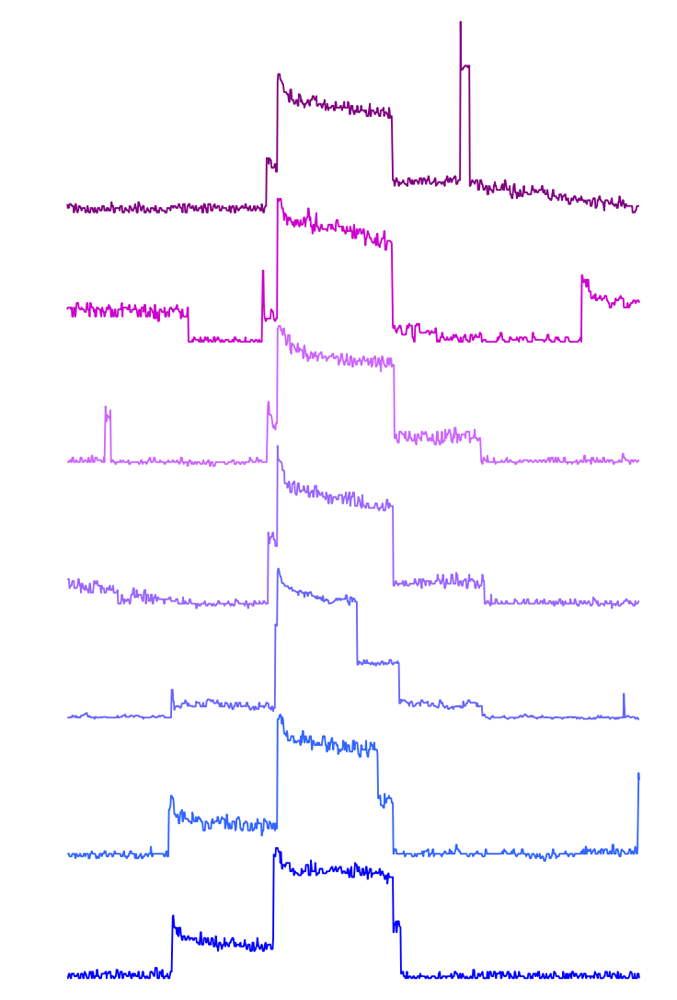
```

# The Good, the Bad and the Ugly

```{r goodbadugly, echo=FALSE, fig.cap="🌵"}

```

## The Good

Besides detecting that something has changed, we have to decide if the alarm must be fired or not.

Thus we need to know what are the "signatures" of the True Alarm.

\

```{r thegood, echo=FALSE, fig.cap=paste0("Fig. ", ref("fig:thegood"), ": Example of \"normal\" beats."), fig.height=5}
source(here("scripts/common/read_ecg.R"))
data_fib <- read_ecg_csv(here("inst/extdata/physionet/f543l.hea"))
data_fib <- tibble(time = data_fib[[1]]$time, II = data_fib[[1]]$II)

thegood <- ggplot(data_fib, aes(time, II)) +
  geom_line(size = 0.3) +
  coord_cartesian(xlim = c(20, 30), ylim = c(-2.5, 2.5)) +
  ggtitle("\"Normal\" rhythm (The good)") +
  theme_grey(base_size = 15)

thegood
```

## The Bad

```{r thebad, echo=FALSE, fig.cap=paste0("Fig. ", ref("fig:thebad"), ": Transition to \"abnormal\" beats."), fig.height=5}
thebad <- ggplot(data_fib, aes(time, II)) +
  geom_line(size = 0.3) +
  coord_cartesian(xlim = c(206, 216), ylim = c(-2.5, 2.5)) +
  ggtitle("\"Abnormal\" rhythm (The bad)") +
  theme_grey(base_size = 15)

thebad
```

## The Ugly

```{r theugly, echo=FALSE, fig.cap=paste0("Fig. ", ref("fig:theugly"), ": Transition to artifacts."), fig.height=5}
data_vfib <- read_ecg_csv(here("inst/extdata/physionet/v770s.hea"))
data_vfib <- tibble(time = data_vfib[[1]]$time, II = data_vfib[[1]]$II)

theugly <- ggplot(data_vfib, aes(time, II)) +
  geom_line(size = 0.3) +
  coord_cartesian(xlim = c(290, 300)) +
  ggtitle("Artifacts (The ugly)") +
  theme_grey(base_size = 15)

theugly
```

## Das Model

{style="position: absolute;right: 6em;padding: 15px;top: 3em;box-shadow: inset 0px 0px 8px 0px;"
width="197"}

```{r shapelets2, echo=FALSE, out.width="60%", fig.cap=paste("Figure", ref("fig:shapelets"), "- Pipeline for TRUE and FALSE alarm classification")}

```

## Das Model

Some hypotheses were thought out:

1.  clustering similar patterns
2.  anomaly detection
3.  forecasting
4.  **classification**

An initial set of shapelets [@Rakthanmanon2013] may be sufficient to rule in or out the `TRUE`/`FALSE` challenge.
Depending on the accuracy of this approach and the resources available, another method can be introduced for both (1)
improving the "negative" samples and (2) learning more shapelets to improve the `TRUE`/`FALSE` alarm discrimination.

------------------------------------------------------------------------------------------------------------------------

Following the Matrix Profile framework, the Contrast Profile [@Mercer2021] seems the most appropriated for this task
(Fig. `r ref("fig:contrast")`):

```{r contrast, echo=FALSE, out.width="100%", fig.cap=paste("Figure", ref("fig:contrast"), "- Contrast Profile of ECG record with Premature Ventricular Contractions. (original from Mercer et al.)")}
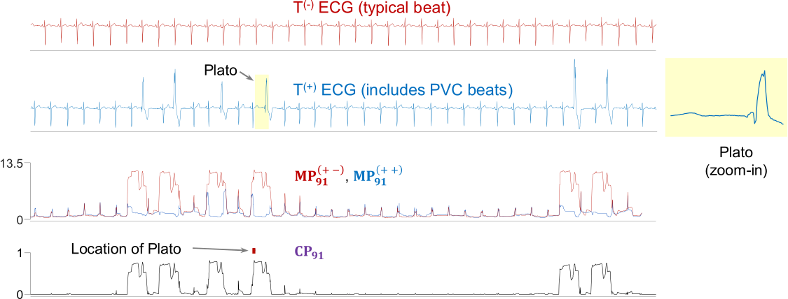
```

------------------------------------------------------------------------------------------------------------------------

A "work in progress" example on Physionet's dataset for ventricular tachycardia `TRUE` alarms (Fig.
`r ref("fig:vtachy")`):

```{r vtachy, echo=FALSE, fig.cap=paste0("Fig. ", ref("fig:vtachy"), ": Shapelet candidates for Ventricular Tachycardia."), fig.height=9, fig.width=14}
def_par <- graphics::par(no.readonly = TRUE)
graphics::layout(matrix(1:6, ncol = 2, byrow = TRUE))
graphics::par(mai = c(0.8, 0.5, 0.6, 0.5), cex = 1)

data <- readRDS(here("presentations/Report/contrast.rds"))

for (i in (1:6)) {
  plot(tsmp:::znorm(data[[i]]$plato), type = "l", ylab = "", xlab = "samples (250hz)")
  for (j in seq_along(data[[i]]$neighbors)) {
    lines(tsmp:::znorm(data[[i]]$neighbors[[j]]$data), col = j + 1)
  }
}
graphics::par(def_par)
```

# Feasibility trial

A brief mentioning, linking back to the objectives of this work, an initial trial was done using an ESP32 MCU (Fig.
`r ref("fig:esp32")`) in order to be sure if such small device can handle the task.

```{r esp32, echo=FALSE, out.width="40%", fig.cap=paste("Figure", ref("fig:esp32"), "- ESP32 MCU")}
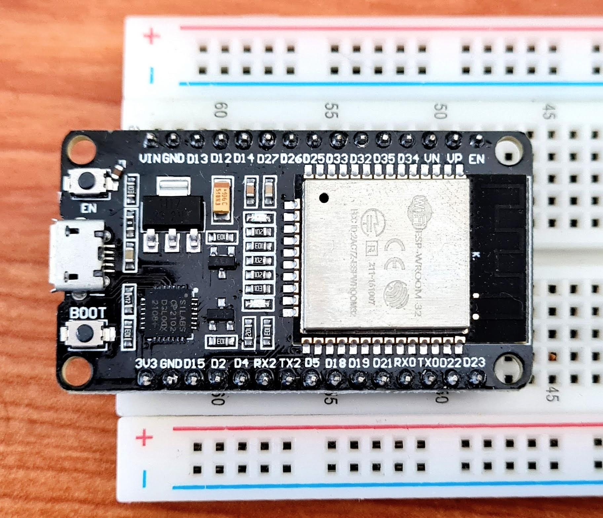
```

Current results show that such device has enough computation power to handle the task in real-time using just one of its
two microprocessors. The main limitation seen in advance is the on-chip SRAM that must be well managed.

# Scientific Contributions

1.  **On regime change detection:** in the original paper, the FLOSS algorithm assumes the *Arc Counts* follow a
    "uniform distribution" when we add a temporal constraint (not considering arcs coming from older data), and the *Arc
    Counts* of newly incoming data are truncated by the same amount of temporal constraint. This prevents completely the
    detection of a regime change in the last 10 seconds as required. [This issue is overcome using the theoretical
    distributions as shown previously]{.slide .destaque}.

2.  **On the Matrix Profile:** The main the issue with the original algorithms are their dependency on a fast Fourier
    transform (FFT) library. FFT has been extensively optimized and architecture/CPU bounded to exploit the most of
    speed. Time complexity doesn't always mean "faster" when we can exploit low-level instructions. FFT is overkilling
    for a low-power device. So we are using an algorithm that does not requires FFT, and is much faster in our setting:
    MPX. Performance: 4KB on FFT \~47Hz, MPX \~422Hz (\~2.5kHz) on an ESP32 MCU (Fig. `r ref("fig:esp32")`). [Here, the
    contribution of this work is adding the *online* capability to MPX]{.slide .destaque}.

3.  **On extending the Matrix Profile:** [an unexplored constraint that we could apply on building the Matrix Profile we
    are calling *Similarity Threshold* (ST)]{.slide .destaque}. The ST is an interesting factor that we can use,
    especially when detecting pattern changes during time. The FLOSS algorithm relies on counting references between
    indexes in the time series. ST can help remove "noise" from these references since only similar patterns above a
    certain threshold are referenced, and changes have more impact on these counts.

# Further Steps

-   Cross-validation and evaluation of the algorithm
-   Publish results
-   Combine fading factors[@Gama2013; @Rodrigues2010] to reduce computation requirements

# References

::: {#refs}
:::
