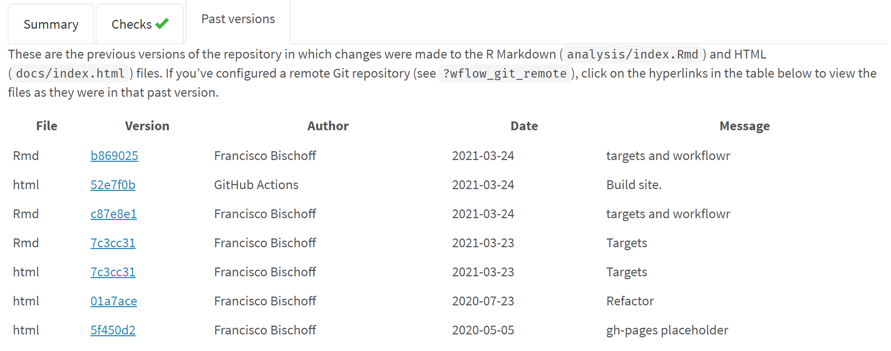
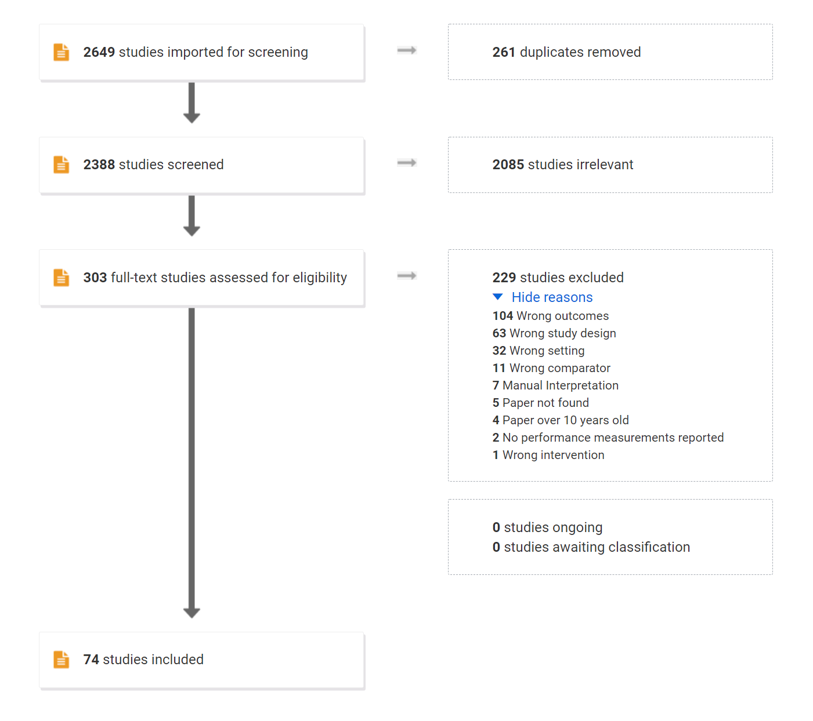
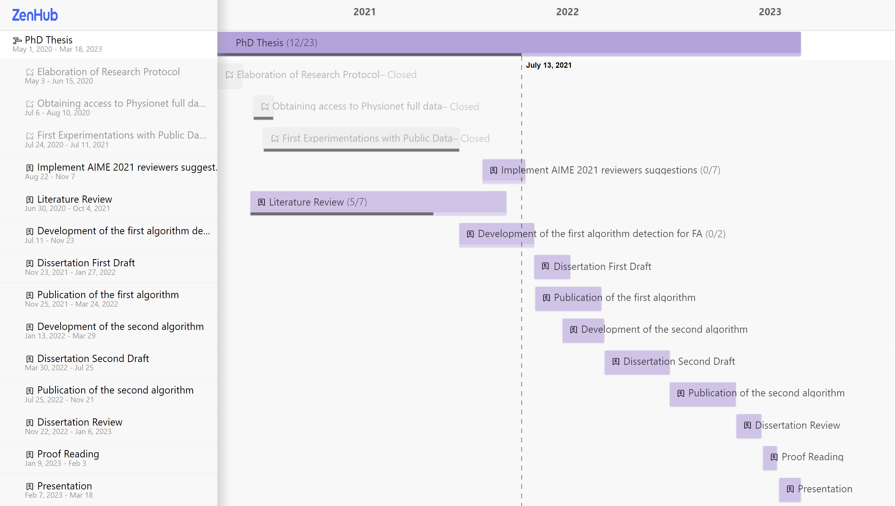
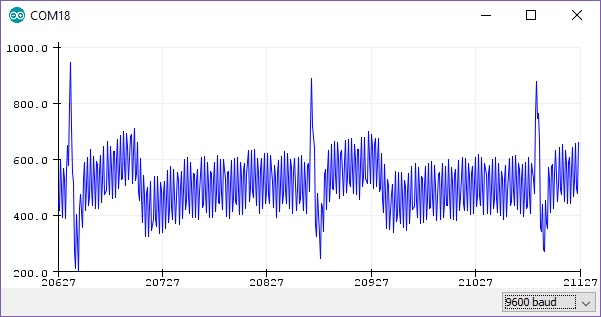
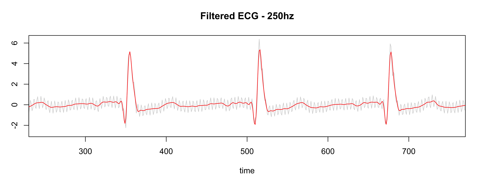
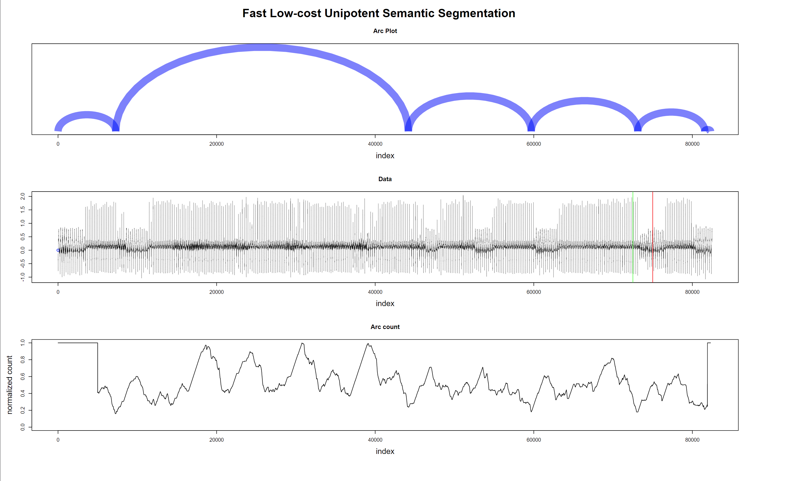
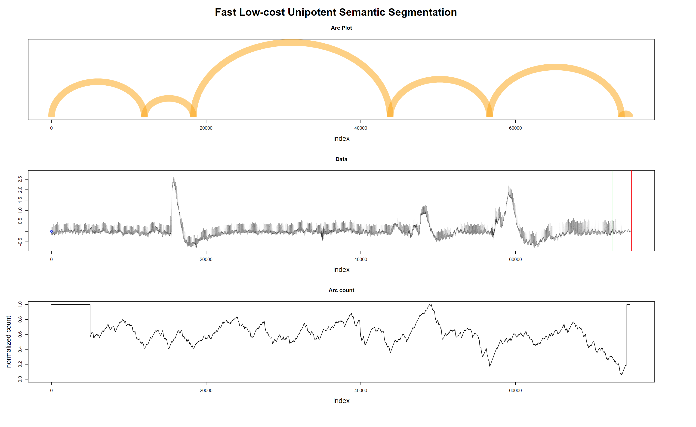

```{=html}
<style>
div.figure {
  padding: 10px;
  margin: 20px 0px 20px 0px;
  background-color: white;
  box-shadow: 0 4px 8px 0 rgba(0, 0, 0, 0.2), 0 6px 20px 0 rgba(0, 0, 0, 0.19);
}
p.caption {
  font-size: 19px;
}
</style>
```
```{r setup, include=FALSE}
knitr::opts_chunk$set(echo = FALSE, fig.align = "center")
library(here)
library(visNetwork)
library(tibble)
library(kableExtra)
library(targets)
```

Last Updated: `r lubridate::now("UTC")` UTC

# Research Title

"Detecting life-threatening patterns in Point-of-care ECG using efficient memory and processor
power."

## Author

Francisco Bischoff

## Key-words

anomaly detection, ECG, fading factors, matrix profile, time series, point-of-care

# Abstract

Currently, Point-of-Care (POC) ECG monitoring works either as plot devices or alarms for abnormal
cardiac rhythms using predefined normal trigger ranges and some rhythm analysis, which raises the
problem of false alarms. In comparison, complex 12-derivation ECG machines are not suitable to use
as simple monitors and are used with strict techniques for formal diagnostics. We aim to identify,
on streaming data, life-threatening hearth electric patterns to reduce the number of false alarms,
using low CPU and memory maintaining robustness. The study design is comparable to a diagnostic
study, where high accuracy is essential. Physionet's 2015 challenge yielded very good algorithms for
reducing false alarms. However, none of the authors reported benchmarks, memory usage, robustness
test, or context invariance that could assure its implementation on real monitors to reduce alarm
fatigue indeed. We expect to identify the obstacles of detecting life-threatening ECG changes within
memory, space, and CPU constraints and to reduce ECG monitor's false alarms using the proposed
methodology, and assess the feasibility of implementing the algorithm in the real world and other
settings than ICU monitors.

# Introduction

Currently, Point-of-Care (POC) ECG monitoring works either as plot devices or alarms for abnormal
cardiac rhythms using predefined normal trigger ranges. Modern devices also incorporate algorithms
to analyze arrhythmias improving their specificity. On the other hand, full 12-derivation ECG
machines are complex, are not suited to use as simple monitors, and are used with strict techniques
for formal diagnostics of hearth electric conduction pathologies. The automatic diagnostics are
derived from a complete analysis of the 12-dimension data after it is fully and well collected. Both
systems do not handle disconnected leads and patient's motions, being strictly necessary to have a
good and stable signal to allow proper diagnosis. These interferences with the data collection
frequently originate false alarms increasing both patient and staff's stress; depending on how it is
measured, the rate of false alarms (overall) in ICU is estimated at 65 to 95% [@donchin2002].

Alarm fatigue is a well-known problem that consists of a sensory overload of nurses and clinicians,
resulting in desensitization to alarms and missed alarms (the "crying wolf" situation). Patient
deaths have been attributed to alarm fatigue [@sendelbach2013]. In 1982, the increase in alarms with
"no end in sight"; studies have demonstrated that most alarm signals have no clinical relevance and
lead to clinical personnel's delayed response. Ultimately patient deaths were reported related to
inappropriate responses to alarms [@sendelbach2013].

In April of 2013, The Joint Commission [@the_jc] issued the Sentinel Event Alert
[@JointCommission2013], establishing alarm system safety as a top hospital priority in the National
Patient Safety Goal. Nowadays (2021), the subject stil on their list, in fourth place of importance
[@the_jc2021].

In February of 2015, the CinC/Physionet Challenge 2015 was about "Reducing False Arrhythmia Alarms
in the ICU [@Clifford2015]. The introduction article stated that it had been reported that up to 86%
resulting of the alarms are false, and this can lead to decreased staff attention and an increase in
patients' delirium [@Lawless1994; @Chambrin2001; @Parthasarathy2004].

Due to this matter's importance, this research aims to identify abnormal hearth electric patterns
using streaming data, specifically those who are life-threatening, reducing the false alarms, being
a reliable signal for Intensive Care Units to respond quickly to those situations.

# Objectives and the research question

This research aims to identify, on streaming data, abnormal hearth electric patterns, specifically
those which are life-threatening, to be a reliable signal for Intensive Care Units to respond
quickly to those situations. It also may be able to continuously analyze new data and correct itself
shutting off false alarms.

As it is known, this goal is not a new problem, so the main questions to solve are: (1) Can we
reduce the number of false alarms in the ICU setting? (2) Can we accomplish this objective using a
minimalist approach (low CPU, low memory) while maintaining robustness? (3) Can this approach be
used in other health domains other than ICU or ECG?

# Type of study

This thesis will be a diagnostic study as the algorithm must classify the change in pattern as
positive or negative for life-threatening.

# Current Work Status

## Principles

This research is being conducted using the Research Compendium principles [@compendium2019]:

1.  Stick with the convention of your peers;
2.  Keep data, methods, and output separated;
3.  Specify your computational environment as clearly as you can.

Data management is following the FAIR principle (findable, accessible, interoperable, reusable)
[@wilkinson2016].

## The data

The current dataset used is the CinC/Physionet Challenge 2015 public dataset, modified to include
only the actual data and the header files in order to be read by the pipeline and is hosted by
Zenodo [@bischoff2021] under the same license as Physionet.

The dataset is composed of 750 patients with at least five minutes records. All signals have been
resampled (using anti-alias filters) to 12 bit, 250 Hz and have had FIR bandpass (0.05 to 40Hz) and
mains notch filters applied to remove noise. Pacemaker and other artifacts still present on the ECG
[@Clifford2015]. Furthermore, this dataset contains at least two ECG derivations and one or more
variables like arterial blood pressure, photoplethysmograph readings, and respiration movements.

The *event* we seek to improve is the detection of a life-threatening arrhythmia as defined by
Physionet in Table \@ref(tab:alarms).

```{r alarms, echo=FALSE}
alarms <- tribble(
  ~Alarm, ~Definition,
  "Asystole", "No QRS for at least 4 seconds",
  "Extreme Bradycardia", "Heart rate lower than 40 bpm for 5 consecutive beats",
  "Extreme Tachycardia", "Heart rate higher than 140 bpm for 17 consecutive beats",
  "Ventricular Tachycardia", "5 or more ventricular beats with heart rate higher than 100 bpm",
  "Ventricular Flutter/Fibrillation", "Fibrillatory, flutter, or oscillatory waveform for at least 4 seconds"
)

kbl(alarms, booktabs = TRUE, caption = "Definition of the five alarm types used in CinC/Physionet Challenge 2015 challenge.", align = "ll") %>%
  kable_styling(full_width = TRUE) %>%
  # column_spec(c(1,2), width = "50px") %>%
  row_spec(0, bold = TRUE)
```

The fifth minute is precisely where the alarm has been triggered on the original recording set. To
meet the ANSI/AAMI EC13 Cardiac Monitor Standards [@AAMI2002], the onset of the event is within 10
seconds of the alarm (i.e., between 4:50 and 5:00 of the record). That doesn't mean that there are
no other arrhythmias before, but those were not labeled.

## Workflow

All steps of the process are being managed using the R package `targets` [@landau2021] from data
extraction to the final report, as shown in Fig. \@ref(fig:targets).

```{r targets, echo=FALSE, out.width="100%", fig.cap="Reproducible research workflow using `targets`."}
knitr::include_graphics("figure/targets.png")
```

The report is available on the main webpage [@franz_website], allowing inspection of previous
versions managed by the R package `workflowr`[@workflowr2021], as shown in Fig.
\@ref(fig:workflowr).

```{r workflowr, echo=FALSE, out.width="100%", fig.cap="Reproducible reports using `workflowr`."}

```

## Work in Progress

### Project start

The project started with a literature survey on the databases Scopus, Pubmed, Web of Science, and
Google Scholar with the following query (the syntax was adapted for each database):

```{=tex}
\setstretch{1}
\begin{verbatim}
TITLE-ABS-KEY ( algorithm  OR  'point of care'  OR  'signal processing'  OR  'computer
assisted'  OR  'support vector machine'  OR  'decision support system*'  OR  'neural
network*'  OR  'automatic interpretation' OR 'machine learning')  AND  TITLE-ABS-KEY
( electrocardiography  OR  cardiography  OR  'electrocardiographic tracing'  OR  ecg
OR  electrocardiogram  OR  cardiogram )  AND  TITLE-ABS-KEY ( 'Intensive care unit' OR
'cardiologic care unit'  OR  'intensive care center'  OR  'cardiologic care center' )
\end{verbatim}
\setstretch{1.5}
```
The inclusion and exclusion criteria were defined as in Table \@ref(tab:criteria).

```{r criteria, echo=FALSE}
criteria <- tribble(
  ~"Inclusion criteria", ~"Exclusion criteria",
  "ECG automatic interpretation", "Manual interpretation",
  "ECG anomaly detection", "Publication older than ten years",
  "ECG context change detection", "Do not attempt to identify life-threatening arrhythmias, namely asystole, extreme bradycardia, extreme tachycardia, ventricular tachycardia, and ventricular flutter/fibrillation",
  "Online Stream ECG analysis", "No performance measurements reported",
  "Specific diagnosis (like a flutter, hyperkalemia, etc.)", ""
)

kbl(criteria, booktabs = TRUE, caption = "Literature review criteria.", align = "ll") %>%
  kable_styling(full_width = TRUE) %>%
  column_spec(1, width = "10cm") %>%
  row_spec(0, bold = TRUE)
```

The current stage of the review is on Data Extraction, from the resulting screening shown in Fig.
\@ref(fig:prisma).

```{r prisma, echo=FALSE, out.width="80%", fig.cap="Prisma results"}

```

Meanwhile, the project pipeline has been set up on GitHub, Inc. [@bischoffrepo2021] leveraging on
Github A ions [@gitactions2021] for the Continuous Integration lifecycle, the repository is
available at [@bischoffrepo2021], and the resulting report is available at [@franz_website] for
transparency while the roadmap and tasks are managed using the integrated Zenhub [@zenhub2021].

As it is known worldwide, 2020 was hard on every project, which required changes on the timeline. In
Fig. \@ref(fig:zenhub1) it is shown the initial roadmap (as of May 2020) and Fig. \@ref(fig:zenhub2)
the modified roadmap (as of July 2021).

```{r zenhub1, echo=FALSE, out.width="100%", fig.cap="Roadmap original"}
knitr::include_graphics("figure/roadmap_original.png")
```

```{r zenhub2, echo=FALSE, out.width="100%", fig.cap="Roadmap updated"}

```

### Preliminary Experimentations

**RAW Data**

While programming the pipeline for the current dataset, it has been acquired a Single Lead Heart
Rate Monitor breakout from Sparkfun^TM^ [@sparkfun2021] using the AD8232 [@AnalogDevices2020]
microchip from Analog Devices Inc., compatible with Arduino^(R)^ [@arduino2021], for an in-house
experiment (Figs. \@ref(fig:ad8232) and \@ref(fig:fullsetup)).

```{r ad8232, echo=FALSE, out.width="50%", fig.cap="Single Lead Heart Rate Monitor"}
knitr::include_graphics("figure/sparkfun.jpg")
```

```{r fullsetup, echo=FALSE, out.width="50%", fig.cap="Single Lead Heart Rate Monitor"}
knitr::include_graphics("figure/FullSetup.jpg")
```

The output gives us a RAW signal as shown in Fig. \@ref(fig:rawsignal).

```{r rawsignal, echo=FALSE, out.width="50%", fig.cap="RAW output from Arduino at ~300hz"}

```

After applying the same settings as the Physionet database (collecting the data at 500hz, resample
to 250hz, pass-filter, and notch filter), the signal is much better as shown in Fig.
\@ref(fig:filtersignal). Note: the leads were not placed on the correct location.

```{r filtersignal, echo=FALSE, out.width="100%", fig.cap="Gray is RAW, Red is filtered"}

```

So in this way, we allow us to import RAW data from other devices and build our own test dataset in
the future.

**Detecting Regime Changes**

The regime change approach will be using the *Arc Counts*, as explained elsewhere [@gharghabi2018].
The current implementation of the Matrix Profile in R, maintained by the first author of this
thesis, is being used to accomplish the computations. This package was published in R Journal
[@RJ-2020-021].

A new concept was needed to be implemented on the algorithm in order to emulate (in this first
iteration) the behavior of the real-time sensor: the search must only look for previous information
within a time constraint. Thus, both the Matrix Profile computation and the *Arc Counts* needed to
be adapted for this task.

At the same time, the ECG data needs to be "cleaned" for proper evaluation. That is different from
the initial filtering process. Several SQIs (Signal Quality Indexes) are used on literature
[@eerikainen2015], some trivial measures as *kurtosis*, *skewness*, median local noise level, other
more complex as pcaSQI (the ratio of the sum of the five largest eigenvalues associated with the
principal components over the sum of all eigenvalues obtained by principal component analysis
applied to the time aligned ECG segments in the window). By experimentation (yet to be validated), a
simple formula gives us the "complexity" of the signal and correlates well with the noisy data is
shown in Equation \@ref(eq:complex).

```{=tex}
\begin{equation}
\sqrt{\sum_{i=1}^w((x_{i+1}-x_i)^2)}, \quad \text{where}\; w \; \text{is the window size} (\#eq:complex)
\end{equation}
```
\
\
The Fig. \@ref(fig:sqi) shows some SQIs.

```{r sqi, echo=FALSE, out.width="100%", fig.cap="Green line is the \"complexity\" of the signal"}
knitr::include_graphics("figure/noise.png")
```

Finally, a sample of the regime change detection is shown in Figs. \@ref(fig:regimefilter) to
\@ref(fig:regimetrue).

Fig. \@ref(fig:regimefilter) shows that noisy data (probably patient muscle movements) are marked
with a blue point and thus are ignored by the algorithm. Also, valid for the following plots, the
green and red lines on the data mark the 10 seconds window where the "event" that triggers the alarm
is supposed to happen.

```{r regimefilter, echo=FALSE, out.width="100%", fig.cap="Regime changes with noisy data - false alarm"}
knitr::include_graphics("figure/regime_filter.png")
```

In Fig. \@ref(fig:regimefalse), the data is clean; thus, nothing is excluded. Interestingly one of
the detected regime changes is inside the "green-red" window. But it is a false alarm.

```{r regimefalse, echo=FALSE, out.width="100%", fig.cap="Regime changes with good data - false alarm"}

```

The last plot (Fig. \@ref(fig:regimetrue)) shows the algorithm's robustness, not excluding good data
with a wandering baseline, and the last regime change is correctly detected inside the "green-red"
window.

```{r regimetrue, echo=FALSE, out.width="100%", fig.cap="Regime changes with good but wandering data - true alarm"}

```

## Scientific outcomes

This research has already yielded two R packages concerning the Matrix Profile algorithms from UCR [@mpucr]. The first package is called `tsmp`, and a paper has also been published in the R Journal [@RJ-2020-021]. The journal is indexed in the Science Citation Index Expanded, and according to the Journal Citation Reports, the journal has a 2020 impact factor of 3.984. The second package is called `matrixprofiler` and improves the first one, using low-level language to improve computational speed. The author has also joined the Matrix Profile Foundation as co-founder together with contributors from Python and Go languages  [@mpf2020].


# Research Team

-   Thesis Author: Francisco Bischoff
-   Supervisor: Professor Pedro Pereira Rodrigues
-   Co-supervisor: Professor Eamonn Keogh (UCR, Riverside)

# Expected results and outcomes

We expect the following results: (1) Identify the obstacles of identifying life-threatening ECG
changes within memory, space, and CPU constraints. (2) Be able to reduce ECG monitor's false alarms
using the proposed methodology. (3) Assess the feasibility of implementing the algorithm in the real
world and other settings than ICU monitors.

And outcomes: (1) To achieve a better score of false alarm reduction than the best on Physionet's
2015 challenge. (2) To push forward the state-of-the-art technology on false alarms reduction, maybe
even being domain agnostic. (3) To draw more attention to fading factors as a reliable, fast, and
cheap approximation of the true value. (4) To draw more attention to the matrix profile concept as
an efficient, agnostic, and almost parameter-free way to analyze time series. (5) To draw more
attention of the Patient Monitorization industry on solving the false alarm problem.

# References
