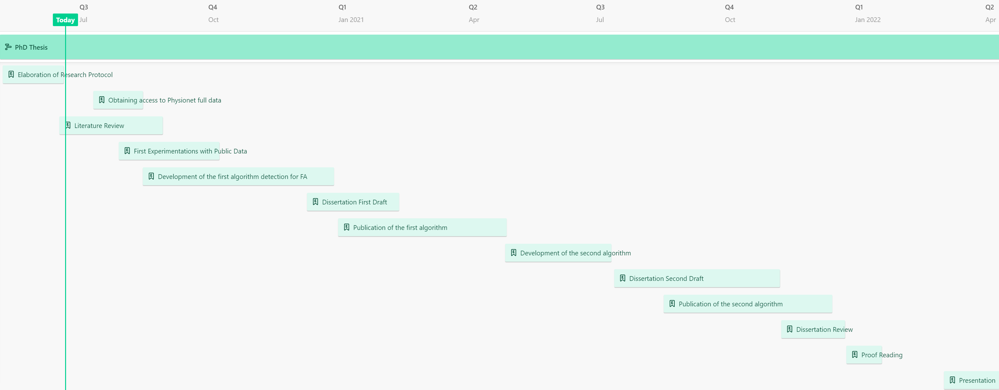

Research Protocol
================
Francisco Bischoff

-   [Identification of the project](#identification-of-the-project)
    -   [Title of the protocol (in Portuguese and
        English)](#title-of-the-protocol-in-portuguese-and-english)
    -   [Author](#author)
    -   [Key-words](#key-words)
    -   [Project start date and
        duration](#project-start-date-and-duration)
-   [Abstract or Summary (in Portuguese and
    English)](#abstract-or-summary-in-portuguese-and-english)
-   [Rationale](#rationale)
-   [Research question and aims](#research-question-and-aims)
-   [Background / Literature review](#background--literature-review)
-   [Research plan and methods](#research-plan-and-methods)
    -   [Type of study](#type-of-study)
    -   [Selection of data](#selection-of-data)
    -   [Sample size](#sample-size)
    -   [Variables](#variables)
    -   [Statistical analysis](#statistical-analysis)
-   [Research Team](#research-team)
-   [Tasks, milestones and timeline](#tasks-milestones-and-timeline)
    -   [Tasks](#tasks)
    -   [Milestones](#milestones)
    -   [Timeline](#timeline)
-   [Budget](#budget)
-   [Expected results and outcomes](#expected-results-and-outcomes)
    -   [Expected results](#expected-results)
    -   [Outcomes](#outcomes)
-   [References](#references)

Last Updated: 2021-05-14 15:40:59 UTC

<!-- -*- mode: gfm; extensions: +tex_math_dollars+raw_tex -*- -->

# Identification of the project

## Title of the protocol (in Portuguese and English)

“Detecting life-threatening patterns in Point-of-care ECG using
efficient memory and processor power.”

“Detectando padrões de risco de vida no ECG no local de atendimento
usando memória e potência do processador eficientes.”

## Author

Francisco Bischoff

## Key-words

anomaly detection, ECG, fading factors, matrix profile, time series,
point-of-care

## Project start date and duration

From the 3rd quarter of 2020 to the fourth quarter of 2022.

# Abstract or Summary (in Portuguese and English)

*Atualmente, o monitoramento de ECG junto ao doente (point-of-care)
funciona com dispositivos que apenas mostram informação ou disparam
alarmes para ritmos cardíacos anormais, usando intervalos normais
predefinidos como gatilho. Por outro lado, máquinas completas de ECG de
12 derivações são muito complexas para serem usadas como monitores
simples e são usadas com técnicas estritas para o diagnóstico formal de
patologias da condução elétrica cardíaca, e o diagnóstico automático é
derivado de uma análise completa dos dados das 12 dimensões após
totalmente coletados. Ambos os sistemas não funcionam com linhas
desconectadas e movimentos do paciente, sendo estritamente necessário
ter um sinal bom e estável para permitir o diagnóstico adequado.*

*Esta investigação tem como objetivo identificar padrões elétricos
cardíacos anormais usando dados em tempo real, especificamente aqueles
padrões que implicam risco de vida, e fornecer um sinal confiável para
que as Unidades de Terapia Intensiva respondam rapidamente a essas
situações.*

*O desenho do estudo é comparável a um estudo de diagnóstico, onde a
alta precisão é essencial. Serão utilizados os conjuntos de dados da
Physionet e o algoritmo tentará minimizar os falsos negativos e
positivos.*

*O resultado esperado é a concretização de um novo método que, além de
preciso, realiza essa tarefa usando tecnologia de ponta de análise de
séries temporais que requeira o mínimo de memória e processamento para
resolver esse problema. Além disso, espera-se que a utilização de
“fading factors” possam contribuir para o estado da arte desta
tecnologia.*

*A equipe de pesquisa é experiente em séries temporais e estuda o
“Matrix Profile” desde suas raizes, sendo fundadores da “Matrix Profile
Foundation,” cujo objetivo é ter uma API multi-linguagem concisa e
estável para desenvolvimento com a tecnologia “Matrix
Profile.”*[1](#ref-Bischoff2019a),[2](#ref-VanBenschoten2020)

Currently, Point-of-Care (POC) ECG monitoring works either as plot
devices or alarms for abnormal cardiac rhythms using predefined normal
trigger ranges. On the other hand, full 12-derivation ECG machines are
complex to use as simple monitors and are used with strict techniques
for formal diagnostics of hearth electric conduction pathologies, and
the automatic diagnostics are derived from a full analysis of the
12-dimension data after it is fully collected. Both systems do not
handle disconnected leads and patient’s motions, being strictly
necessary to have a good and stable signal to allow proper diagnosis.

This research aims to identify abnormal hearth electric patterns using
streaming data, specifically those who are life-threatening, being a
reliable signal for Intensive Care Units to respond quickly to those
situations.

The study design is comparable to a Diagnostic study, where high
accuracy is essential. It will use the Physionet datasets, and the
algorithm will try to minimize the false negatives and false positives.

The expected result is the concretization of a new method that, besides
being accurate, accomplishes this task using state of the art technology
for time series analysis that allows minimum space and processor power
to solve this problem. Also, we expect that fading factors can
contribute to the state of the art of this technology.

The research team is well experienced in time-series and has studied the
Matrix Profile since its beginning, being founders of the Matrix Profile
Foundation whose goal is to have a concise and stable cross-language API
for developing with the Matrix Profile
technology.[1](#ref-Bischoff2019a),[2](#ref-VanBenschoten2020)

# Rationale

Currently, Point-of-Care (POC) ECG monitoring works either as plot
devices and/or alarms for abnormal cardiac rhythms using predefined
normal trigger ranges. On the other hand, full 12-derivation ECG
machines are complex to use as simple monitors and are used with strict
techniques for formal diagnostics of hearth electric conduction
pathologies, and the automatic diagnostics are derived from a full
analysis of the 12-dimension data after it is fully collected. In
CinC/Physionet Challenge 2015, it has been reported that up to 86%
resulting of the alarms are false and this can lead to decreased staff
attention and increase in patients
delirium.[3](#ref-Lawless1994)–[5](#ref-Parthasarathy2004)

# Research question and aims

This research aims to identify, on streaming data, abnormal hearth
electric patterns, specifically those who are life-threatening, in order
to be a reliable signal for Intensive Care Units to respond quickly to
those situations. It also may be able to continuously analyze new data
and correct itself shutting off false alarms. Primarily an experiment
will be conducted using 2 main algorithms that use Matrix Profile in
detecting context changes: SDTD and FLOSS. One uses whole data training
and testing, and the other uses a streaming approach that is our main
interest. The goal will be detecting the transition from normal to
flutter/FA to normal condition with special attention to not rely on
rhythm changes. Being this successful, a more generalistic approach will
be attempted: to detect changes from normal to abnormal to normal
conditions, with special attention to handle with disconnected leads or
patient movements. Finally, this research can prove to be a good
addition to the Matrix Profile method, using fading factors in order to
reduce memory and space consumption, lowering the processor power
needed, allowing this algorithm to be used in almost any device.

# Background / Literature review

In 2015 the PhysioNet/Computing in Cardiology has launched a challenge
to address the problem of high false alarm rates by encouraging the
development of new algorithms to improve the specificity of ICU
alarms[6](#ref-Clifford2015). This challenge comprised of
minimizing the false alarms for five life-threatening arrhythmia:
asystole, extreme bradycardia, extreme tachycardia, ventricular
tachycardia and ventricular fibrillation or flutter.

There are other arrhytmias that this challenge didn’t assessed, like
atrial standstill (hyperkalemia), third-degree atrioventricular block
and others that may be life-threatening in some settings like atrial
fibrillation (AF), a, atrialflutter and paroxysmal supraventricular
tachycardia. Pulseless electrical activity is a frequent condition in
cardiac arrest but cannot be identified without blood pressure
information.

They used as score the following formula:

 

The five-best scores (for real-time) in this challenge were:

| Score | Authors                                                  |
|------:|:---------------------------------------------------------|
| 81.39 | Filip Plesinger, Petr Klimes, Josef Halamek, Pavel Jurak |
| 79.44 | Vignesh Kalidas                                          |
| 79.02 | Paula Couto, Ruben Ramalho, Rui Rodrigues                |
| 76.11 | Sibylle Fallet, Sasan Yazdani, Jean-Marc Vesin           |
| 75.55 | Christoph Hoog Antink, Steffen Leonhardt                 |

Challenge Results

A literature review will be conducted to assess the state of the art for
ECG automatic processing:

-   The memory and space used to perform the main goal of the algorithm
    (sound an alarm for ex.) will be collected i available.
-   The type of algorithms used to identify ECG anomalies
-   The type of algorithms used to identify specific diagnosis (like a
    flutter, hyperkalemia, etc.)
-   Their performance (accuracy, ROC, etc.)

A broad search will be conducted on Pubmed, Scopus, Google Scholar,
device manuals, and other specific sources.

Keywords:

-   ECG AND monitoring AND ICU
-   ECG AND \[time series\]
-   ECG AND automatic AND interpretation

Articles published after “The PhysioNet/Computing in Cardiology
Challenge 2015: Reducing False Arrhythmia Alarms in the ICU,” will also
be analyzed.

# Research plan and methods

## Type of study

This will be a diagnostic study as the algorithm must classify the
change in pattern as positive or negative for life-threatening.

## Selection of data

Initially, the data used for exploring the properties of the algorithm
will be publicly available data on
Physionet[6](#ref-Clifford2015),[7](#ref-Goldberger2000).

It will be asked for Physionet’s permission to use more sensitive data
if needed.

It is desirable that real data extracted from Portuguese ICU could be
used in the final stage to assess in real settings the validity of the
model.

## Sample size

There is no upper size limitation for the sample size. At least one
hundred cases may be reasonable to start with.

## Variables

The first available dataset contains either 549 conventional 12-lead
resting ECGs or the corresponding measured Frank Lead System ECGs. The
ECGs are digitized at a sampling rate of 1000Hz (0.5 µV/LSB; 16 Bit
ADC). On special request, this database may be available at sampling
rates up to 10,000Hz.

Every patient is supplied with an information string containing age,
gender, diagnosis, and where applicable, data on the medical history,
medications and interventions, coronary artery pathology,
ventriculography, echocardiography, and hemodynamics.

These variables may or may not be useful for increasing the sensitivity
or specificity of the algorithm. It is planned to use the minimum set of
derivations from the 12-lead ECG to classify at first a common Atrial
Fibrillation.

## Statistical analysis

The Statistical analysis will be performed using R language v3.6.0 or
greater, and it will be computed the ROC curve for the algorithm.

# Research Team

-   Thesis Author: Francisco Bischoff
-   Supervisor: Professor Pedro Pereira Rodrigues
-   Co-supervisor: Professor Eamonn Keogh (UCR, Riverside)

# Tasks, milestones and timeline

## Tasks

The timeline is composed of larger tasks I call Epics. They contain
multiple subtasks that are expected to change frequently.

-   **Elaboration of Research Protocol**

    1.  Duration: 1 months 12 days;
    2.  Elaboration of this protocol in order to facilitate the
        management and overview of the project;
    3.  This task was developed by the author with input suggestions
        from other experts.

-   **Literature Review**

    1.  Duration: 2 months 12 days;
    2.  This task aims to survey the literature about what is currently
        done to tackle the current problem and what th limitations are;
        Aim and outputs for the task (and relation with the next task);
    3.  This task will be done with three independent reviewers using
        the PRISMA guidelines in the Covidence framework.

-   **Obtaining Access to Physionet full data**

    1.  Duration: 1 months 4 days
    2.  All datasets in Physionet are supposed to be Open Access.
        However, there is a chance that some datasets may nee
        permissions.
    3.  If any dataset needs permission, it will be first evaluated the
        real need and asked the proper way to access it.

-   **First Experimentation with Public data**

    1.  Duration: 2 months 9 days
    2.  The Physionet Challenge from 2015 will be the first dataset to
        be analyzed and will be *a study in scarlet* fo the problems we
        may face in this kind of dataset;
    3.  The datasets will be studied in the case of data preparation for
        the modeling process.

-   **Development of the First Algorithm**

    1.  Duration: 4 months 13 days;
    2.  In this task, the first model will be constructed: the Atrial
        Fibrillation start/end detection;
    3.  The state of the art methods will be used to detect such
        changes, with maximum precision and lowest memory an processor
        usage;
    4.  This task depends on the knowledge about the dataset we have
        from the previous task.

-   **Dissertation First Draft**

    1.  Duration: 2 months 3 days;
    2.  This task aims to, at the same time, create a draft for the
        final dissertation, and the content for an actua article to be
        published;
    3.  This task depends on the concretization of the previous task.

-   **Publication of the First Algorithm**

    1.  Duration: 3 months 29 days
    2.  This task aims to refine the text, review, and submit it for
        publication.
    3.  The length of this task depends on several variables, including
        the journal review time;
    4.  This task depends on the previous task;
    5.  Financial needs: Publication fees.

-   **Development of the Second Algorithm**

    1.  Duration: 2 months 14 days
    2.  In this task, the second model will be constructed: an attempt
        to generalize it for any life-threatening ECG change;
    3.  The state of the art methods will be used to detect such
        changes, with maximum precision and lowest memory and processor
        usage;

-   **Dissertation Second Draft**

    1.  Duration: 3 months 25 days
    2.  This task aims to, at the same time, create a second draft for
        the final dissertation, and the content for an actual article to
        be published;
    3.  This task depends on the concretization of the previous task.

-   **Publication of the Second Algorithm**

    1.  Duration: 3 months 27 days
    2.  This task aims to refine the text, review, and submit it for
        publication.
    3.  The length of this task depends on several variables, including
        the journal review time;
    4.  This task depends on the previous task;
    5.  Financial needs: Publication fees.

-   **Dissertation Review**

    1.  Duration: 1 months 15 days
    2.  This task will be a time to review all the work done and prepare
        it for final presentation;
    3.  Ideally, two or mode independent expert shall read the thesis
        and give feedback for improvement;

-   **Proof Reading**

    1.  Duration: 0 months 25 days
    2.  This task comprises in careful reading, ideally by a
        professional in the English language;
    3.  It depends on the previous tasks;
    4.  Financial needs: Proofreading fees

-   **Presentation**

    1.  Duration: 1 months 11 days
    2.  This task comprises in preparation for public presentation;
    3.  It includes the formulation of the slides or any multimedia
        support that shall be needed;
    4.  This task depends on having the dissertation done.

## Milestones

| Milestone | Date      | Name              | Description                               |
|:----------|:----------|:------------------|:------------------------------------------|
| M1        | Jul, 2020 | Protocol          | Finish and Deliver Protocol               |
| M2        | Oct, 2020 | Literature Review | Finish Literature Review                  |
| M3        | Apr, 2021 | Paper 1           | Finish and Submit for Publication Paper 1 |
| M4        | Jan, 2022 | Paper 2           | Finish and Submit for Publication Paper 2 |
| M5        | Dec, 2022 | Thesis            | Finish and Deliver Ph.D. Thesis           |

Milestones

## Timeline

Click on the image to open an interactive Gantt webpage

# Budget

| Items           | Budget | Justification             | Obtained |
|:----------------|-------:|:--------------------------|:---------|
| Travel expenses |   5000 | International Conferences | No       |
| Conferences     |   3000 | Registration Fees         | No       |
| Tuition Fees    |  11000 | Researcher Maintenance    | No       |

Expected expenses

# Expected results and outcomes

## Expected results

It is expected that a novel algorithm to detect life-threatening ECG
changes can be achieved using lower memory and processor power than the
existing ones, maintaining the overall performance level.

## Outcomes

This research will yield at least two publications in indexed journals
as well as the final thesis will be available in the university
repository.

# References

1. Bischoff F, Rodrigues PP. Tsmp: An r package
for time series with matrix profile. Published online April 2019.
doi:[10.13140/rg.2.2.13040.30726](https://doi.org/10.13140/rg.2.2.13040.30726)

2. Van Benschoten A, Ouyang A, Bischoff F, Marrs
T. MPA: A novel cross-language API for time series analysis. *Journal of
Open Source Software*. 2020;5(49):2179.
doi:[10.21105/joss.02179](https://doi.org/10.21105/joss.02179)

3. Lawless ST. Crying wolf: False alarms in a
pediatric intensive care unit. *Critical care medicine*.
1994;22(6):981-985.

4. Chambrin MC. Alarms in the intensive care unit:
How can the number of false alarms be reduced? *Critical care (London,
England)*. 2001;5(4):184-188.
doi:[10.1186/cc1021](https://doi.org/10.1186/cc1021)

5. Parthasarathy S, Tobin MJ. Sleep in the
intensive care unit. *Intensive Care Medicine*. 2004;30(2):197-206.
doi:[10.1007/s00134-003-2030-6](https://doi.org/10.1007/s00134-003-2030-6)

6. Clifford GD, Silva I, Moody B, et al. The
PhysioNet/computing in cardiology challenge 2015: Reducing false
arrhythmia alarms in the ICU. In: *Computing in Cardiology*.; 2015.
doi:[10.1109/cic.2015.7408639](https://doi.org/10.1109/cic.2015.7408639)

7. Goldberger A, Amaral L, Glass L, et al.
PhysioBank, PhysioToolkit, and PhysioNet: Components of a new research
resource for complex physiologic signals. *Circulation \[online\]*.
2000;101(23):e215-e220.

