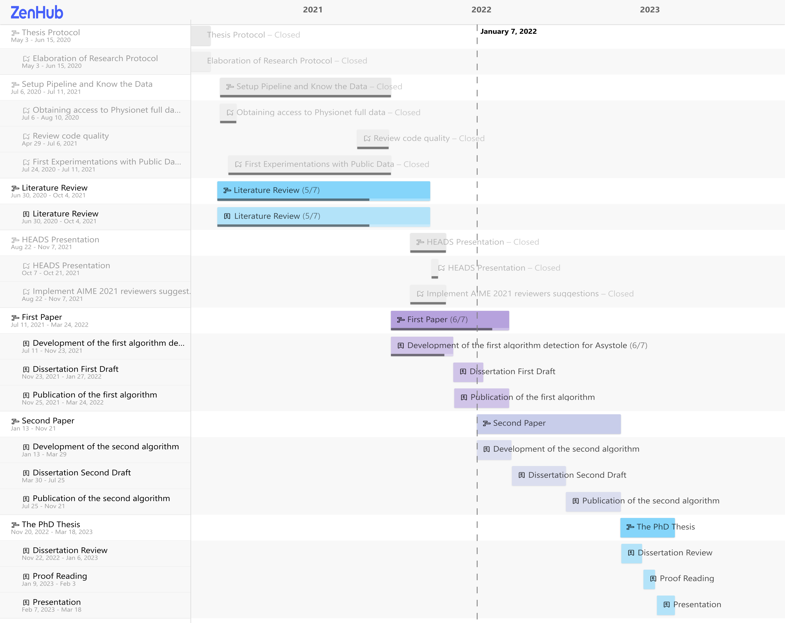

<!--
Sugestões:
jgama:
[ ]jgama: The document is not self-content
[ ]jgama: - Refer to lots of things that not describe
[ ]jgama: *** The FLOSS algorithm
[ ]jgama: *** Explain how we obtain the arcs how to interpret them
[ ]jgama: *** RQ is reduce the ICU false alarm?
[ ]jgama: *** As it is written, reduce the FA is like do not report any alarm
[ ]jgama: *** Be very precise about the goal
[ ]jgama: - The competition, the formula is not on the report
[ ]jgama: *** they penalize the FN, why?

[ ]jgama: - Be VERY clear about the experimental setup evaluation criteria
[ ]jgama: *** What you want to minimize
[ ]jgama: *** What is your target

[ ]jgama: - Cross validation: explain, it for TS
[ ]jgama: *** Explain the Full dataset: are patients, not one TS. A set of patients
[ ]jgama: *** You never talked about patients
[ ]jgama: *** BE MORE PRECISE on the report
[ ]jgama: - Green red lines??

[ ]jgama: - Research question - Must be proven
[ ]jgama: - Evaluation criteria - Must be proven
[ ]jgama: - Experimental setup - Must be proven

[ ]jgama: - The description of the method must be self-content

Tiago:
[ ]Tiago: - Purpose and steps to take: beat SOTA or cheap hardware?
[ ]Tiago: - TSMP- base publication
[ ]Tiago: - Better motivate devices

Eamonn:
[ ]Eamonn: - How "local" is the information in medical telemetry? For example, it is helpful to have the data for the last 20min, or we need only "local" data of the last ten seconds? (speculate)
[ ]Eamonn: - In more general case, do alarms have to be binary? For ex, could you generalize to "no alarm" "minor alarm" "strong alarm". Could we exploit this fact to - reduce cost of error; use less CPU or memory; or something.
[ ]Eamonn: - The algorithm, if tuned for some individual, will it work well in another? There are some input variables that can change the results?


But the train-test prediction task is not representative of everything we might wish to do with
models. For example, some statisticians prefer to evaluate predictions using a prequential frame-
work, in which models are judged on their accumulated learning error over the training sample.101
And once you start using multilevel models, "prediction" is no longer uniquely defined, because the
test sample can differ from the training sample in ways that forbid use of some the parameter esti-
mates. We'll worry about that issue in Chapter 12.

If adding more information you consistently get worse results, that would suggest that the new data
is wrongly labelled, noisy or that it contradicts the previously seen one for some reason (e.g.,
some information might have changed over time).

- https://www.cs.waikato.ac.nz/~eibe/pubs/Twitter-crc.pdf
A common problem is that for unbalanced data streams with, for example, 90% of the instances in one
class, the simplest classifiers will have high accuracies of at least 90%. To deal with this type of
data stream, we propose to use the Kappa statistic, based on a sliding window, as a measure for
classifier performance in unbalanced class streams.

https://moa.cms.waikato.ac.nz/prequential-cross-validation-evaluation/


1. Dawid, A.P.: Present Position and Potential Developments: Some Personal Views: Statistical
   Theory: The Prequential Approach. Journal of the Royal Statistical Society. Series A (General).
   147, 2, 278 (1984). https://doi.org/10.2307/2981683.

- Prequential forecasting: Probability forecasting + sequential predictions
- Means: Predict tomorrow. Tomorrow we confirm and learn about the outcome.
- Any statistical model can be converted to prequential: replace the unknown parameter in the
  predictive distribution of the next observation by an estimate based on the data collected so far.
- A PFS (prequential forecasting system) has, on the known values, a model that may be an assumed
  time-series structure, or, a Bayesian uncertainty. This model will condition the Probability of
  the forecasted value.
- The Prequential Principle: to assess the overall adequacy of the model, such assessment should
  depend only on the model through the *sequence* of forecasts that it in fact made. Analogously to
  the Likelihood Principle, hypothetical predictions that the model could have made under
  circumstances that did not happen are irrelevant.
- Calibration and Jeffreys' Law: For a binary outcome, there is a criterion of *complete
  calibration* for comparing the prequential probabilities of the model with the outcomes. It
  requires that the average of the prequential probabilities of the model, for a suitable subset,
  should agree asymptotically with the corresponding average of the outcomes. Furthermore, if two
  models satisfy this criterion for many subsets (thus P(model1) - P(model2) -> 0 as n -> Inf), then
  all non-rejected PFSs end up making the same forecasts. "When a law has been applied to a large
  body of data without any systematic discrepancy being detected, it leads to the result that the
  probability of a further inference from the law approaches certainty whether the law is true or
  not." Sir H. Jeffreys, 1938
- For continuous outcomes, we can reduce the "average of the prequential probabilities of the model" to
  whether a sequence of forecasts "looks like" a random sample of the model.

1. Gama, J. et al.: A survey on concept drift adaptation. ACM Computing Surveys. 46, 4, 1-37 (2014).
   https://doi.org/10.1145/2523813.

The real concept drift refers to changes in the conditional distribution of the output (i.e.,
target variable) given the input (input features), while the distribution of the input may stay
unchanged.

-->

```{=html}
<style>
div.figure {
  padding: 10px;
  margin: 20px 0px 20px 0px;
  background-color: white;
  box-shadow: 0 4px 8px 0 rgba(0, 0, 0, 0.2), 0 6px 20px 0 rgba(0, 0, 0, 0.19);
}
p.caption {
  padding: 20px 0px 0px 0px;
  font-size: 19px;
}
</style>
```

```{r setup, include=FALSE}
knitr::opts_chunk$set(
  echo = FALSE, fig.align = "center", autodep = TRUE,
  fig.height = 5, fig.width = 10,
  tidy = "styler",
  tidy.opts = list(strict = TRUE)
)
if (knitr::is_latex_output()) {
  knitr::opts_chunk$set(dev = "pdf")
} else {
  knitr::opts_chunk$set(dev = "svg")
}

library(here)
library(visNetwork)
library(tibble)
library(kableExtra)
library(gridExtra)
library(targets)
library(ggplot2)
knitr::opts_knit$set(root.dir = here("protocol"), base.dir = here("protocol"), verbose = TRUE)
```

Last Updated: `r lubridate::now("UTC")` UTC

# Research Title

"Detecting life-threatening patterns in Point-of-care ECG using efficient memory and processor
power."

## Author

Francisco Bischoff

## Key-words

anomaly detection, ECG, fading factors, matrix profile, time series, point-of-care

# Abstract

Currently, Point-of-Care (POC) ECG monitoring works either as plot devices or alarms for abnormal
cardiac rhythms using predefined normal trigger ranges and some rhythm analysis, which raises the
problem of false alarms. In comparison, complex 12-derivation ECG machines are not suitable to use
as simple monitors and are used with strict techniques for formal diagnostics. We aim to identify,
on streaming data, life-threatening hearth electric patterns to reduce the number of false alarms,
using low CPU and memory maintaining robustness. The study design is comparable to a diagnostic
study, where high accuracy is essential. Physionet's 2015 challenge yielded very good algorithms for
reducing false alarms. However, none of the authors reported benchmarks, memory usage, robustness
test, or context invariance that could assure its implementation on real monitors to reduce alarm
fatigue indeed. We expect to identify the obstacles of detecting life-threatening ECG changes within
memory, space, and CPU constraints and to reduce ECG monitor's false alarms using the proposed
methodology, and assess the feasibility of implementing the algorithm in the real world and other
settings than ICU monitors.

# Introduction

Currently, Point-of-Care (POC) ECG monitoring works either as plot devices or alarms for abnormal
cardiac rhythms using predefined normal trigger ranges. Modern devices also incorporate algorithms
to analyze arrhythmias improving their specificity. On the other hand, full 12-derivation ECG
machines are complex, are not suited to use as simple monitors, and are used with strict techniques
for formal diagnostics of hearth electric conduction pathologies. The automatic diagnostics are
derived from a complete analysis of the 12-dimension data after it is fully and well collected. Both
systems do not handle disconnected leads and patient's motions, being strictly necessary to have a
good and stable signal to allow proper diagnosis. These interferences with the data collection
frequently originate false alarms increasing both patient and staff's stress; depending on how it is
measured, the rate of false alarms (overall) in ICU is estimated at 65 to 95% [@donchin2002].

Alarm fatigue is a well-known problem that consists of a sensory overload of nurses and clinicians,
resulting in desensitization to alarms and missed alarms (the "crying wolf" situation). Patient
deaths have been attributed to alarm fatigue [@sendelbach2013]. In 1982, the increase in alarms with
"no end in sight"; studies have demonstrated that most alarm signals have no clinical relevance and
lead to clinical personnel's delayed response. Ultimately patient deaths were reported related to
inappropriate responses to alarms [@sendelbach2013].

In April of 2013, The Joint Commission [@the_jc] issued the Sentinel Event Alert
[@JointCommission2013], establishing alarm system safety as a top hospital priority in the National
Patient Safety Goal. Nowadays (2021), the subject is still on their list, in fourth place of
importance [@the_jc2021].

In February of 2015, the CinC/Physionet Challenge 2015 was about "Reducing False Arrhythmia Alarms
in the ICU [@Clifford2015]. The introduction article stated that it had been reported that up to 86%
resulting of the alarms are false, and this can lead to decreased staff attention and an increase in
patients' delirium [@Lawless1994; @Chambrin2001; @Parthasarathy2004].

Due to this matter's importance, this research aims to identify abnormal hearth electric patterns
using streaming data, specifically those who are life-threatening, reducing the false alarms, being
a reliable signal for Intensive Care Units to respond quickly to those situations.

# Objectives and the research question

This research aims to identify, on streaming data, abnormal hearth electric patterns, specifically
those which are life-threatening, to be a reliable signal for Intensive Care Units to respond
quickly to those situations. It also may be able to continuously analyze new data and correct itself
shutting off false alarms.

As it is known, this goal is not a new problem, so the main questions to solve are: (1) Can we
reduce the number of false alarms in the ICU setting? (2) Can we accomplish this objective using a
minimalist approach (low CPU, low memory) while maintaining robustness? (3) Can this approach be
used in other health domains other than ICU or ECG?

# Type of study

This thesis will be a diagnostic study as the algorithm must classify the change in pattern as
positive or negative for life-threatening.

# Work Structure

The changes, additions, and deletions from the First Report to this Second Report can be visualized
[here](https://github.com/franzbischoff/false.alarm/compare/dc34ece..a9a9bc4#diff-f34a6bd3da5c4faa6a8103611963f84ee3070b59f1f517ea418e9774b4d718da).

## Principles

This research is being conducted using the Research Compendium principles [@compendium2019]:

1.  Stick with the convention of your peers;
2.  Keep data, methods, and output separated;
3.  Specify your computational environment as clearly as you can.

Data management follows the FAIR principle (findable, accessible, interoperable, reusable)
[@wilkinson2016]. Concerning these principles, the dataset was converted from Matlab's format to
CSV format, allowing more interoperability. Additionally, all the project, including the dataset, is
in conformity with the Codemeta Project [@CodeMeta2017].

## The data

The current dataset used is the CinC/Physionet Challenge 2015 public dataset, modified to include
only the actual data and the header files in order to be read by the pipeline and is hosted by
Zenodo [@bischoff2021] under the same license as Physionet.

The dataset is composed of 750 patients with at least five minutes records. All signals have been
resampled (using anti-alias filters) to 12 bit, 250 Hz and have had FIR band-pass (0.05 to 40Hz) and
mains notch filters applied to remove noise. Pacemaker and other artifacts are still present on the ECG
[@Clifford2015]. Furthermore, this dataset contains at least two ECG derivations and one or more
variables like arterial blood pressure, photoplethysmograph readings, and respiration movements.

The _event_ we seek to improve is the detection of a life-threatening arrhythmia as defined by
Physionet in Table \@ref(tab:alarms).

```{r alarms, echo=FALSE}
alarms <- tribble(
  ~Alarm, ~Definition,
  "Asystole", "No QRS for at least 4 seconds",
  "Extreme Bradycardia", "Heart rate lower than 40 bpm for 5 consecutive beats",
  "Extreme Tachycardia", "Heart rate higher than 140 bpm for 17 consecutive beats",
  "Ventricular Tachycardia", "5 or more ventricular beats with heart rate higher than 100 bpm",
  "Ventricular Flutter/Fibrillation", "Fibrillatory, flutter, or oscillatory waveform for at least 4 seconds"
)

kbl(alarms, booktabs = TRUE, caption = "Definition of the five alarm types used in CinC/Physionet Challenge 2015 challenge.", align = "ll") %>%
  kable_styling(full_width = TRUE) %>%
  # column_spec(c(1,2), width = "50px") %>%
  row_spec(0, bold = TRUE)
```

The fifth minute is precisely where the alarm has been triggered on the original recording set. To
meet the ANSI/AAMI EC13 Cardiac Monitor Standards [@AAMI2002], the onset of the event is within 10
seconds of the alarm (i.e., between 4:50 and 5:00 of the record). That doesn't mean that there are
no other arrhythmias before, but those were not labeled.

## Workflow

All steps of the process are being managed using the R package `targets` [@landau2021] from data
extraction to the final report, as shown in Fig. \@ref(fig:targets).

```{r targets, echo=FALSE, out.width="100%", fig.cap="Reproducible research workflow using 'targets'."}
knitr::include_graphics("figure/targets.png")
```

The report is available on the main webpage [@franz_website], allowing inspection of previous
versions managed by the R package `workflowr`[@workflowr2021], as shown in Fig.
\@ref(fig:workflowr).

```{r workflowr, echo=FALSE, out.width="100%", fig.cap="Reproducible reports using 'workflowr'."}
knitr::include_graphics("figure/workflowr_print.png")
```

## Work in Progress

### Project start

The project started with a literature survey on the databases Scopus, PubMed, Web of Science, and
Google Scholar with the following query (the syntax was adapted for each database):

```{=tex}
\setstretch{1}
\begin{verbatim}
TITLE-ABS-KEY ( algorithm  OR  'point of care'  OR  'signal processing'  OR  'computer
assisted'  OR  'support vector machine'  OR  'decision support system*'  OR  'neural
network*'  OR  'automatic interpretation' OR 'machine learning')  AND  TITLE-ABS-KEY
( electrocardiography  OR  cardiography  OR  'electrocardiographic tracing'  OR  ecg
OR  electrocardiogram  OR  cardiogram )  AND  TITLE-ABS-KEY ( 'Intensive care unit' OR
'cardiologic care unit'  OR  'intensive care center'  OR  'cardiologic care center' )
\end{verbatim}
\setstretch{1.5}

```

The inclusion and exclusion criteria were defined as in Table \@ref(tab:criteria).

```{r criteria, echo=FALSE}
criteria <- tribble(
  ~"Inclusion criteria", ~"Exclusion criteria",
  "ECG automatic interpretation", "Manual interpretation",
  "ECG anomaly detection", "Publication older than ten years",
  "ECG context change detection", "Do not attempt to identify life-threatening arrhythmias, namely asystole, extreme bradycardia, extreme tachycardia, ventricular tachycardia, and ventricular flutter/fibrillation",
  "Online Stream ECG analysis", "No performance measurements reported",
  "Specific diagnosis (like a flutter, hyperkalemia, etc.)", ""
)

kbl(criteria, booktabs = TRUE, caption = "Literature review criteria.", align = "ll") %>%
  kable_styling(full_width = TRUE) %>%
  column_spec(1, width = "10cm") %>%
  row_spec(0, bold = TRUE)
```

The current stage of the review is on Data Extraction, from the resulting screening shown in Fig.
\@ref(fig:prisma).

```{r prisma, echo=FALSE, out.width="80%", fig.cap="Prisma results"}
knitr::include_graphics("figure/PRISMA.png")
```

Meanwhile, the project pipeline has been set up on GitHub, Inc. [@bischoffrepo2021] leveraging on
Github Actions [@gitactions2021] for the Continuous Integration lifecycle. The repository is
available at [@bischoffrepo2021], and the resulting report is available at [@franz_website] for
transparency while the roadmap and tasks are managed using the integrated Zenhub [@zenhub2021].

As it is known worldwide, since 2020, the measures taken to control the SARS-Cov2 pandemic
have had a great impact on any development lifecycle.

At this moment, this project went through two timeline changes. In Fig. \@ref(fig:zenhub1) it is
shown the initial roadmap (as of May 2020), Fig. \@ref(fig:zenhub2) the modified roadmap (as of July
2021), and Fig. \@ref(fig:zenhub3) (as of Jan 2022). The literature survey is currently in the extraction
phase, which includes about 74 articles from the full-text screening.

```{r zenhub1, echo=FALSE, out.width="100%", fig.cap="Roadmap original"}
knitr::include_graphics("figure/roadmap_original.png")
```

```{r zenhub2, echo=FALSE, out.width="100%", fig.cap="Roadmap updated on August 2021"}
knitr::include_graphics("figure/roadmap_updated.png")
```

```{r zenhub3, echo=FALSE, out.width="100%", fig.cap="Roadmap updated on January 2022"}

```

### Preliminary Experimentations

#### RAW Data

While programming the pipeline for the current dataset, it has been acquired a Single Lead Heart
Rate Monitor breakout from Sparkfun^TM^ [@sparkfun2021] using the AD8232 [@AnalogDevices2020]
microchip from Analog Devices Inc., compatible with Arduino^(R)^ [@arduino2021], for an in-house
experiment (Figs. \@ref(fig:ad8232) and \@ref(fig:fullsetup)).

```{r ad8232, echo=FALSE, out.width="50%", fig.cap="Single Lead Heart Rate Monitor"}
knitr::include_graphics("figure/sparkfun.jpg")
```

```{r fullsetup, echo=FALSE, out.width="50%", fig.cap="Single Lead Heart Rate Monitor"}
knitr::include_graphics("figure/FullSetup.jpg")
```

The output gives us a RAW signal, as shown in Fig. \@ref(fig:rawsignal).

```{r rawsignal, echo=FALSE, out.width="50%", fig.cap="RAW output from Arduino at ~300hz"}
knitr::include_graphics("figure/arduino_plot.jpg")
```

After applying the same settings as the Physionet database (collecting the data at 500hz, resample
to 250hz, pass-filter, and notch filter), the signal is much better, as shown in Fig.
\@ref(fig:filtersignal). Note: the leads were not placed in the correct location.

```{r filtersignal, echo=FALSE, out.width="100%", fig.cap="Gray is RAW, Red is filtered"}
knitr::include_graphics("figure/filtered_ecg.png")
```

So in this way, we allow us to import RAW data from other devices and build our own test dataset in
the future.

#### Detecting Regime Changes

The regime change approach will be using the _Arc Counts_, as explained elsewhere [@gharghabi2018].
The current implementation of the Matrix Profile in R, maintained by the first author of this
thesis, is being used to accomplish the computations. This package was published in R Journal
[@RJ-2020-021].

A new concept was needed to be implemented on the algorithm in order to emulate (in this first
iteration) the behavior of the real-time sensor: the search must only look for previous information
within a time constraint. Thus, both the Matrix Profile computation and the _Arc Counts_ needed to
be adapted for this task.

At the same time, the ECG data needs to be "cleaned" for proper evaluation. That is different from
the initial filtering process. Several SQIs (Signal Quality Indexes) are used in the literature
[@eerikainen2015], some trivial measures as _kurtosis_, _skewness_, median local noise level, other
more complex as pcaSQI (the ratio of the sum of the five largest eigenvalues associated with the
principal components over the sum of all eigenvalues obtained by principal component analysis
applied to the time aligned ECG segments in the window). By experimentation (yet to be validated), a
simple formula gives us the "complexity" of the signal and correlates well with the noisy data is
shown in Equation \@ref(eq:complex).

\
\
```{=tex}
\begin{equation}
\sqrt{\sum_{i=1}^w((x_{i+1}-x_i)^2)}, \quad \text{where}\; w \; \text{is the window size} (\#eq:complex)
\end{equation}
```
\
\
The Fig. \@ref(fig:sqi) shows some SQIs.

```{r sqi, echo=FALSE, out.width="100%", fig.cap="Green line is the \"complexity\" of the signal"}
knitr::include_graphics("figure/noise.png")
```

Finally, a sample of the regime change detection is shown in Figs. \@ref(fig:regimefilter) to
\@ref(fig:regimetrue).

Fig. \@ref(fig:regimefilter) shows that noisy data (probably patient muscle movements) are marked
with a blue point and thus are ignored by the algorithm. Also, valid for the following plots, the
green and red lines on the data mark the 10 seconds window where the "event" that triggers the alarm
is supposed to happen.

```{r regimefilter, echo=FALSE, out.width="100%", fig.cap="Regime changes with noisy data - false alarm"}
knitr::include_graphics("figure/regime_filter.png")
```

In Fig. \@ref(fig:regimefalse), the data is clean; thus, nothing is excluded. Interestingly one of
the detected regime changes is inside the "green-red" window. But it is a false alarm.

```{r regimefalse, echo=FALSE, out.width="100%", fig.cap="Regime changes with good data - false alarm"}
knitr::include_graphics("figure/regime_false.png")
```

The last plot (Fig. \@ref(fig:regimetrue)) shows the algorithm's robustness, not excluding good data
with a wandering baseline, and the last regime change is correctly detected inside the "green-red"
window.

```{r regimetrue, echo=FALSE, out.width="100%", fig.cap="Regime changes with good but wandering data - true alarm"}
knitr::include_graphics("figure/regime_true.png")
```

### First General Assessment

By August 2021, it was clear that the chosen regime detection algorithm would be the (Fast Low-cost
Online Semantic Segmentation) FLOSS [@gharghabi2017]. Thus, the pipeline had to be adapted in order
to allow the careful replication of the streaming process, even though several computations are made
beforehand to keep the pipeline (i.e., the simulation) fast on exploring several parameters.

The choice of FLOSS is founded on the following arguments:

-  **Domain Agnosticism:** the algorithm makes no assumptions about the data as opposed to most
   available algorithms to date.
-  **Streaming:** the algorithm can provide real-time information.
-  **Real-World Data Suitability:** the objective is not to _explain_ all the data. Therefore, areas
   marked as "don't know" areas are acceptable.
-  **FLOSS is not:** a change point detection algorithm [@aminikhanghahi2016]. The interest here is
   changes in the shapes of a sequence of measurements.

Other algorithms we can cite are based on Hidden Markov Models (HMM) that require at least two
parameters set by domain experts: cardinality and dimensionality reduction. The most attractive alternative
could be the Autoplait [@Matsubara2014], which is also domain agnostic and parameter-free. It segments
the time series using Minimum Description Length (MDL) and recursively tests if the region is best modeled
by one or two HMM. However, Autoplait is designed for batch operation, not streaming, and also requires
discrete data. FLOSS was demonstrated to be superior in several datasets in its original paper. In addition,
FLOSS is robust to several changes in data like downsampling, bit depth reduction, baseline wandering,
noise, smoothing, and even deleting 3% of the data and filling with simple interpolation. Finally,
the algorithm is light and suitable for low-power devices.

It is worth also mentioning the Time Series Snippets [@Imani2018], based on MPdist [@gharghabi2018b].
The latter measures the distance between two sequences considering how many similar sub-sequences they
share, no matter the order of matching. It proved to be a useful measure (not a metric) for meaningfully
clustering similar sequences. Time Series Snippets exploits MPdist properties to summarize a dataset that
contains representative sequences. This seems to be an alternative for detecting regime changes, but
it is not. The purpose of this algorithm is to find which pattern(s) explains most of the dataset.
Lastly, MPdist is quite expensive compared to the trivial Euclidean distance.

### Second General Assessment

By January 2022, the following tasks were performed:

1. Restructuring the roadmap (again)
2. Refining the main pipeline (again)
3. Preparing for modeling and parameter tuning
4. Feasibility trial
5. And others

#### Refining the main pipeline

That can also be thought of as "rethinking" the pipeline. Which also leads to the roadmap
restructuration. The new roadmap was already shown above in Fig. \@ref(fig:zenhub3).

It is essential not only to write a pipeline that can "autoplot" itself for fine-grain inspection
but also to design a high-level graph that can explain it "in a glance". This exercise was helpful
both ways: telling the story in a short version also reveals missing things and misleading paths
that are not so obvious when thinking "low-level".

Figs. \@ref(fig:regimedetection), \@ref(fig:shapelets) and \@ref(fig:fullmodel) show the overview
of the processes involved.

```{r regimedetection, echo=FALSE, out.width="100%", fig.cap="Pipeline for regime change detection"}
if (knitr::is_latex_output()) {
  knitr::include_graphics("figure/regime_detection.pdf")
} else {
  knitr::include_graphics("figure/regime_detection.svg")
}
```

```{r shapelets, echo=FALSE, out.width="60%", fig.cap="Pipeline for TRUE and FALSE alarm classification"}
if (knitr::is_latex_output()) {
  knitr::include_graphics("figure/shapelets.pdf")
} else {
  knitr::include_graphics("figure/shapelets.svg")
}
```

```{r fullmodel, echo=FALSE, out.width="60%", fig.cap="Pipeline of the final process"}
if (knitr::is_latex_output()) {
  knitr::include_graphics("figure/fullmodel.pdf")
} else {
  knitr::include_graphics("figure/fullmodel.svg")
}
```

#### Preparing for modeling and parameter tuning

Here is one missing part that should have been addressed (formally) earlier. Although this work has
its purpose of being finally deployed on small hardware, this prospective phase will need several
hours of computing, tuning, evaluation, and validation of all findings.

Thus it was necessary to revisit the frameworks we are used to working on R: `caret` [@JSSv028i05]
and the newest `tidymodels` [@tidymodels2020] collection. For sure, there are other frameworks and
opinions [@Thompson2020]. Notwithstanding, this project will follow the `tidymodels` road. Two
significant arguments 1) constantly improving and constantly being re-checked for bugs; large
community contribution; 2) allows to plug in a custom modeling algorithm that, in this case, will be
the one needed for developing this work.

#### Feasibility trial

A side-project called "false.alarm.io" has been derived from this work (an unfortunate mix of
"false.alarm" and "PlatformIO" [@PlatformIO], the IDE chosen to interface the panoply of embedded
systems we can experiment with). The current results of this side-project are very enlightening and show
that the final algorithm can indeed be used in small hardware. Further data will be available in
the future.

#### And others

After this "step back" to look forward, it was time to define how the regime change algorithm would
integrate with the actual decision of triggering or not the alarm. Some hypotheses were thought out:
(1) clustering similar patterns, (2) anomaly detection, (3) classification, and (4) forecasting.
Among these methods, it was thought, in order to avoid exceeding processor capacity, an initial set
of shapelets [@Rakthanmanon2013] can be sufficient to rule in or out the `TRUE`/`FALSE` challenge.
Depending on the accuracy of this approach and the resources available, another method can be
introduced for both (1) improving the "negative"[^1] samples and (2) learning more shapelets to
improve the `TRUE`/`FALSE` alarm discrimination.

[^1]: The term "negative" does not imply that the patient has a "normal" ECG. It means that the
"negative" section is not a life-threatening condition that needs to trigger an alarm.

### Scientific Contributions

1. **On regime change detection:** in the original paper, the FLOSS algorithm assumes the _Arc
   Counts_ follow a "uniform distribution" when we add a temporal constraint (not considering arcs
   coming from older data), and the _Arc Counts_ of newly incoming data are truncated by the same
   amount of temporal constraint. This prevents completely the detection of a regime change in the
   last 10 seconds as required. This issue is overcome using the theoretical distributions as shown
   in Fig. \@ref(fig:distributions).

2. **On the Matrix Profile:** since the first paper presenting this new concept [@Yeh2017a], lots of
   investigations were made to speed up its computation. It is notable how all computations are not
   dependent on the _rolling window size_ as previous works not using Matrix Profile. Aside from this, we
   can see that the first STAMP [@Yeh2017a] algorithm has the time complexity of $O(n^2log{n})$
   while STOMP [@zhu2016] $O(n^2)$ (a significant improvement), but STOMP lacks the "any-time"
   property. Later SCRIMP [@zhu2018] solves this problem keeping the same time complexity of
   $O(n^2)$. Here we are in the "exact" algorithms domain and will not extend the scope for
   conciseness.

   1. The main issue with the algorithms above is the dependency on a fast Fourier transform (FFT)
      library. FFT has been extensively optimized and architecture/CPU bounded to exploit the most
      of speed. Also, padding data to some power of 2 happens to increase the efficiency of the
      algorithm. We can argue that time complexity doesn't mean "faster" when we can exploit
      low-level instructions. In our case, using FFT in a low-power device is overkilling. For
      example, a quick search over the internet gives us a hint that computing FFT on a 4096 data in
      an ESP32 takes about 21ms (~47 computations in 1 second). This means ~79 seconds for computing
      all FFT's (~3797) required for STAMP using a window of 300. Currently, we can compute a full
      matrix of 5k data in about 9 seconds in an ESP32 MCU (Fig. \@ref(fig:esp32)), and keep updating
      it as fast as 1 min of data (at 250hz) in just 6 seconds.

    2. Recent works using _exact_ algorithms are using an unpublished algorithm called **MPX**, which
       computes the Matrix Profile using cross-correlation methods ending up faster and is easily
       portable.

    3. **The main contribution** of this work on this area is adding the **online** capability to
       MPX, which means we can update the Matrix Profile as new data comes in.

3. **On extending the Matrix Profile:** an unexplored constraint that we could apply on building the
   Matrix Profile we are calling _Similarity Threshold_ (ST). The original work outputs the
   similarity values in Euclidean Distance (ED) values, while MPX naturally outputs the values in
   Pearson's correlation coefficients (CC). Both ED and CC are interchangeable using the equation
   \@ref(eq:edcc). However, we may argue that it is easier to compare values that do not depend on
   the window size during an exploratory phase. MPX happens to naturally return values in CC, saving
   a few more computation time. The ST is an interesting factor that we can use, especially when
   detecting pattern changes during time. The FLOSS algorithm relies on counting references between
   indexes in the time series. ST can help remove "noise" from these references since only similar
   patterns above a certain threshold are referenced, and changes have more impact on these counts.
   The best ST threshold is still to be determined.

\

```{=tex}
\begin{equation}
CC = 1 - \frac{ED}{(2 \times WindowSize)} (\#eq:edcc)
\end{equation}
```
\

```{r dist data, message=FALSE, warning=FALSE, cache=TRUE, include=FALSE}
source(here("scripts", "common", "compute_floss.R"))

get_dist <- function(mp_const = 1250, floss_const = 0) {
  set.seed(2021)
  iac <- list()
  pro_size <- 5000
  mp_time_constraint <- mp_const
  floss_time_constraint <- floss_const
  for (i in 1:500) {
    iac[[i]] <- get_asym(pro_size, mp_time_constraint, floss_time_constraint)
  }

  aic_avg <- rowMeans(as.data.frame(iac))

  data.frame(index = 1:5000, counts = aic_avg)
}

data_5000 <- get_dist(5000)
data_4250 <- get_dist(4250)
data_2500 <- get_dist(2500)
data_1250 <- get_dist(1250)

floss_data_5000 <- get_dist(0, 5000)
floss_data_4250 <- get_dist(0, 4250)
floss_data_2500 <- get_dist(0, 2500)
floss_data_1250 <- get_dist(0, 1250)
```

```{r distributions, echo=FALSE, fig.cap="1D-IAC distributions for earlier temporal constraint (on Matrix Profile)", message=FALSE, warning=FALSE}

floss_dist <- ggplot(data_5000, aes(index, counts)) +
  geom_line(size = 0.1) +
  ggtitle("a) No constraint") +
  theme_grey(base_size = 7)

floss_4250 <- ggplot(data_4250, aes(index, counts)) +
  geom_line(size = 0.1) +
  ggtitle("b) Constraint of 4250") +
  theme_grey(base_size = 7)

floss_2500 <- ggplot(data_2500, aes(index, counts)) +
  geom_line(size = 0.1) +
  annotate("segment", y = 0, yend = max(data_2500$counts), x = 2500, xend = 2500, linetype = 2, size = 0.1) +
  annotate("text", x = 2500 - 80, y = 40, label = "start", color = "black", size = 2, angle = 90, hjust = 0) +
  annotate("segment", y = 0, yend = max(data_2500$counts), x = 5000 - 2500 * 0.9, xend = 5000 - 2500 * 0.9, linetype = 2, size = 0.1) +
  annotate("text", x = 5000 - 2500 * 0.9 - 80, y = 40, label = "end", color = "black", size = 2, angle = 90, hjust = 0) +
  ggtitle("c) Constraint of 2500") +
  theme_grey(base_size = 7)

floss_1250 <- ggplot(data_1250, aes(index, counts)) +
  geom_line(size = 0.1) +
  annotate("segment", y = 0, yend = max(data_1250$counts), x = 1250, xend = 1250, linetype = 2, size = 0.1) +
  annotate("text", x = 1250 - 80, y = 40, label = "start", color = "black", size = 2, angle = 90, hjust = 0) +
  annotate("segment", y = 0, yend = max(data_1250$counts), x = 5000 - 1250 * 0.9, xend = 5000 - 1250 * 0.9, linetype = 2, size = 0.1) +
  annotate("text", x = 5000 - 1250 * 0.9 - 80, y = 40, label = "end", color = "black", size = 2, angle = 90, hjust = 0) +
  ggtitle("d) Constraint of 1250") +
  theme_grey(base_size = 7)

gg <- gridExtra::arrangeGrob(floss_dist, floss_4250, floss_2500, floss_1250,
  nrow = 2,
  bottom = grid::textGrob(paste("The plot a) shows the distribution used for the arc count correction when there is no time constraint.", "\n", "b) Shows a constraint of 3/4 of the total. c) 1/2 of the total. d) 1/4 of the total; here we see clearly the flat line.", "\n", "The dashed line marks the start and the end of the uniform zone."), just = "center", gp = grid::gpar(fontsize = 7))
)

grid::grid.draw(gg)
```

\

```{r esp32, echo=FALSE, out.width="40%", fig.cap="ESP32 MCU"}
knitr::include_graphics("figure/esp32.jpg")
```

\

## Scientific outcomes

This research has already yielded two R packages concerning the Matrix Profile algorithms from UCR
[@mpucr]. The first package is called `tsmp`, and a paper has also been published in the R Journal
[@RJ-2020-021]. The journal is indexed in the Science Citation Index Expanded, and according to the
Journal Citation Reports, the journal has a 2020 impact factor of 3.984. The second package is
called `matrixprofiler` and improves the first one, using low-level language to improve
computational speed. The author has also joined the Matrix Profile Foundation as co-founder together
with contributors from Python and Go languages [@mpf2020].

The benchmarks of this implementation are available online [@Bischoff2021a].

# Research Team

- Thesis Author: Francisco Bischoff
- Supervisor: Professor Pedro Pereira Rodrigues
- Co-supervisor: Professor Eamonn Keogh (UCR, Riverside)

# Expected results and outcomes

We expect the following results: (1) Identify the obstacles of identifying life-threatening ECG
changes within memory, space, and CPU constraints. (2) Be able to reduce ECG monitor's false alarms
using the proposed methodology. (3) Assess the feasibility of implementing the algorithm in the real
world and other settings than ICU monitors.

And outcomes: (1) To achieve a better score of false alarm reduction than the best on Physionet's
2015 challenge. (2) To push forward the state-of-the-art technology on false alarms reduction, maybe
even being domain agnostic. (3) To draw more attention to fading factors as a reliable, fast, and
cheap approximation of the true value. (4) To draw more attention to the matrix profile concept as
an efficient, agnostic, and almost parameter-free way to analyze time series. (5) To draw more
attention of the Patient Monitorization industry on solving the false alarm problem.

# References
